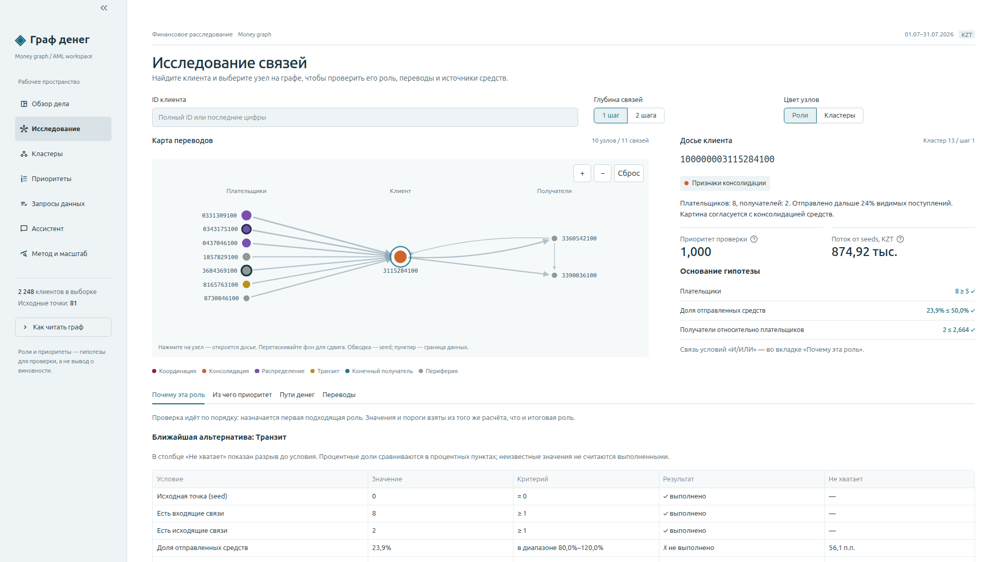
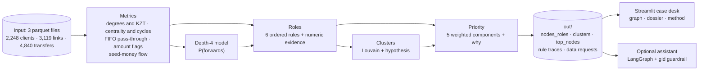

# Money graph

**Follow money from known seeds, inspect the evidence, and choose the next data request.**

Team ker1mGo, case «Граф денег». An AML analyst knows 81 clients who received drug-related money (the *seeds*)
and has their outgoing transfers four hops deep: 2,248 clients in total. Our tool answers the analyst's question
**"which of these clients should I look at first, and why?"** It gives every client a role, a group and a review priority,
each with the evidence behind it. Every finding is a hypothesis for an analyst to check, never an accusation.



**Demo video:** [docs/media/demo.webm](docs/media/demo.webm)

**Contents:** [Launch](#launch) · [How it works](#how-it-works) · [Roles and thresholds](#roles-and-thresholds) ·
[Data schemas](#data-schemas) · [Demo walkthrough](#demo-walkthrough) · [Limitations](#limitations) · [Scaling](#scaling) ·
[Assistant](#optional-assistant) · [Commands](#commands)

## Launch

You need **Python 3.12** and **make** (or Docker, see below). Run everything from the repository root.

**1. Install**

```bash
python3.12 -m venv .venv
source .venv/bin/activate
pip install -r requirements.txt
```

**2. Configure (optional)**

The pipeline and the viewer need no configuration. Only the optional Assistant page needs an API key:

```bash
cp .env.example .env
```

Then open `.env` in any editor and fill in what you need:

```ini
OPENAI_API_KEY=sk-...        # enables the Assistant page; leave empty to skip it
OPENAI_MODEL=                # empty = gpt-4.1-mini
OPENAI_BASE_URL=             # empty = api.openai.com; set it for any OpenAI-compatible endpoint
MONEYGRAPH_PORT=             # Docker only; empty = 8501
```

`.env` is ignored by git and never copied into the Docker image.

**3. Run the pipeline** (the one command that produces the results)

```bash
make run
```

It reads `project_docs/data/`, runs offline in about 10 seconds and writes the three required files
`out/nodes_roles.csv`, `out/clusters.csv` and `out/top_nodes.csv`, plus the evidence the viewer uses.
The run is deterministic: it reproduces the committed `out/` snapshot byte for byte (only the timings in
`pipeline_metadata.json` change).

**4. Open the viewer**

```bash
make app
```

Then go to <http://localhost:8501>.

**With Docker instead** of steps 1–4 (optionally do step 2 first):

```bash
docker compose up --build
```

This runs the pipeline in a container without network access, then serves the viewer on <http://localhost:8501>.
Stop it with `docker compose down`.

## How it works



The method in five steps:

1. **Measure every client.** Distinct payers and recipients, KZT in and out, centrality, short cycles, how much of the
   incoming money leaves within two days (matched transfer by transfer), and amount patterns such as repeated or round sums.
2. **Follow the seed money.** Starting from the seeds' outgoing transfers, money is passed along each link in proportion to KZT,
   never more than a client actually sent. This estimates how much seed money reaches each client and from how many seeds.
3. **Handle the edge of the data.** The crawl stopped at depth 4, so 444 clients there have no visible outgoing transfers.
   Instead of calling them end recipients, a small logistic regression trained on depths 1–3 (where outflows *were* crawled)
   estimates whether each one passes money on (cross-validated AUC 0.733).
4. **Assign roles and groups.** Six ordered, documented rules give each client one role with a score and a numeric evidence line.
   Louvain community detection groups clients, and each group gets a hypothesis.
5. **Rank for review.** Priority combines seed money reached, role, number of source seeds, betweenness, and how much seed flow
   disappears if the client is removed. Every client gets a plain-language `why`.

What is different from a naive approach:

| Naive interpretation | Our treatment |
|---|---|
| No outgoing transfers means an end recipient | The 444 depth-4 clients were never crawled for outgoing transfers; we separate 1,071 observed from 62 inferred terminals |
| Biggest degree or PageRank is the review order | Priority follows where seed money actually goes, and a resilience test shows the trade-off honestly |
| A score is enough | Each client's dossier shows every rule condition with its value and threshold, the nearest missed rule, the priority breakdown and the seed-money paths |
| Missing data is just missing | `data_requests.csv` says what to request next: hop-5 outflows, seed inflows, small unlinked groups |

Each pipeline step in `moneygraph/` exposes `compute(ctx)` and returns columns keyed by `gid`; `run.py` merges them in order.
All thresholds and weights live in [`moneygraph/config.yaml`](moneygraph/config.yaml), each with its reason.
The pipeline never imports the viewer or the assistant; both only read `out/`.

## Roles and thresholds

Rules are checked top to bottom and the first match wins; other rules that also match are listed in `secondary_roles`.

| # | Role | Rule | Why |
|---|---|---|---|
| 1 | **coordinator** | (pays ≥ 2 distinct seeds, or on cycles of length ≤ 4 with ≥ 2 seeds) and (reachable from ≥ 2 seeds, or betweenness ≥ p98) | sends money back into several known couriers while sitting between seed flows |
| 2 | **distributor** | out_deg ≥ 10 and out_deg ≥ 3 × max(in_deg, 1) | fan-out: few sources, many recipients (hubs up to 116 recipients) |
| 3 | **consolidator** | in_deg ≥ 5 and (pass_through ≤ 0.5 or out_deg ≤ in_deg / 3) | many distinct payers, few exits; in_deg ≥ 5 is the 98th percentile |
| 4 | **transit** | non-seed, in ≥ 1, out ≥ 1, and (0.8 ≤ pass_through ≤ 1.2, or ≥ 50% of inflow forwarded within 2 days while pass_through ≤ 2) | passes money on without holding it |
| 5 | **terminal** | out = 0, in ≥ 1, and depth ≤ 3 (`terminal_observed`), or depth 4 with P(forwards) < 0.3 (`terminal_inferred`) | depth 1–3 outflows were crawled, so a sink there is observed; at depth 4 it can only be inferred |
| 6 | **peripheral** | everything else: `truncated_unknown`, `truncated_likely_forwarding` (P > 0.6), `seed_no_outgoing`, `no_edges`, `weak_signal` | stays inside the role dictionary while being honest about gaps |

Seeds never use `in_kzt` or `pass_through`, because their inflow is under-counted by construction.
`role_score` measures how far a client clears each threshold: `0.5 + 0.5 × mean(clip((x − thr) / thr, 0, 1))`;
observed terminals score 0.9, inferred terminals 1 − P(forwards). The evidence line always carries the numbers, e.g.
`8 payers (2 seeds) → 2.16M in; sends on 24%; to 2 recipients; up to 7 payers same day; seed money in 875k; flags burst`.

Result on the supplied data: terminal 1,133 · peripheral 907 · transit 107 · distributor 50 · consolidator 29 · coordinator 22.

**Priority** = seed factor × Σ weight × percentile rank, rescaled so the top client is 1. The weights are seed money reaching the client 0.30,
role 0.25, number of source seeds 0.15, betweenness 0.15 and removal impact 0.15. Seeds get a factor of 0.85 because they are already known,
and the top 30 contains none of them.

The depth-4 model, clusters, priority and resilience are documented with all their numbers in [docs/methodology.md](docs/methodology.md).

## Data schemas

### Input (`project_docs/data/`, supplied, never modified)

| File | Rows | Columns |
|---|---:|---|
| `nodes.parquet` | 2,248 | `gid` int64 client id · `depth` int64 first hop where the client appeared (0 = seed) · `is_seed` bool |
| `edges.parquet` | 3,119 | `src` int64 payer · `dst` int64 recipient · `sum_kzt` float64 July total · `n_tx` int64 transfers · `depth` int8 hop where the link was found |
| `transactions.parquet` | 4,840 | `src` int64 · `dst` int64 · `date` date · `sum_kzt` float64 single transfer (≥ 5,000 KZT) |

### Required outputs (`out/`)

**`nodes_roles.csv`**: one row per client, 2,248 rows.

| Column | Type | Meaning |
|---|---|---|
| `gid` | int64 | client id |
| `role` | str | `coordinator`, `distributor`, `consolidator`, `transit`, `terminal` or `peripheral` |
| `role_score` | float 0–1 | how clearly the role's thresholds are met |
| `cluster_id` | int | community; 0 = clients with no transfers |
| `priority_score` | float 0–1 | review priority; the top client is 1 |
| `evidence` | str ≤ 200 | why this role, with numbers |
| `role_detail` | str | finer label, e.g. `terminal_observed`, `terminal_inferred`, `truncated_unknown`, `seed_no_outgoing` |
| `secondary_roles` | str | other roles whose rules also match, `;`-separated |
| `depth`, `is_seed` | int, bool | copied from the input |

**`clusters.csv`**: one row per community, 45 rows.

| Column | Type | Meaning |
|---|---|---|
| `cluster_id` | int | community id (0 = no transfers) |
| `n_nodes`, `n_seed` | int | clients and seeds in it |
| `sum_kzt_internal` | float | KZT on links inside the community |
| `top_gids` | str | top 5 clients by priority, `;`-separated |
| `hypothesis` | str | what the group may be, e.g. "possible collection cell: …", with numbers |
| `dominant_roles` | str | most common non-peripheral roles, e.g. `terminal:112;transit:15;distributor:7` |
| `seed_flow_in` | float | modelled seed money reaching the community |

**`top_nodes.csv`**: the 30 highest-priority clients, sorted.

| Column | Type | Meaning |
|---|---|---|
| `rank` | int | 1 = look first |
| `gid`, `role`, `priority_score` | int64, str, float | as in `nodes_roles.csv` |
| `why` | str | the three biggest priority contributions in words |
| `cluster_id`, `evidence` | int, str | as in `nodes_roles.csv` |

### Supporting outputs (`out/`)

| File | Contents |
|---|---|
| `data_requests.csv` | `gid, reason, suggested_request`; reasons: `truncated_likely_forwarding`, `seed_no_outgoing`, `seed_inflow_undercounted`, `small_component` |
| `resilience.csv` | `n_removed, strategy, largest_wcc, n_components, seed_flow_reach` for strategies `priority`, `degree`, `degree_nonseed`, `random` |
| `truncation_model.json` | depth-4 model features, cross-validated AUC, coefficients, predicted vs observed forwarding rate |
| `rule_traces.json`, `seed_paths.json` | every rule condition per client, the nearest missed rule, estimated seed-money paths |
| `features.parquet` | every computed metric per client (see [docs/design.md](docs/design.md#feature-contract)) |
| `edges.parquet`, `transactions.parquet` | the transfer evidence, exported so the viewer reads only `out/` |
| `pipeline_metadata.json` | configuration used and measured step timings |
| `bench.csv`, `bench.svg`, `bench_metadata.json` | scale measurements from `make bench` |

## Demo walkthrough

1. **Briefing:** the case scope and data caveats, then open the first review candidate.
2. **Investigate:** search any part of a gid, focus a client, expand one or two hops and follow the transfer arrows.
   The dossier shows each role condition, the priority breakdown and the estimated seed-money paths.
3. **Clusters** and **Priorities:** compare group hypotheses and see why a client enters the review queue.
4. **Data gaps:** the requests for the next crawl, instead of treating missing outflow as a finding.
5. **Method & scale:** depth-4 model validation, resilience, measured runtime and the configuration used.
   The **Assistant** page is optional; every other page works without a key.

## Limitations

- **Nothing here is a verdict.** Roles, clusters and priorities are hypotheses built only from transfer structure, amounts and dates.
- **No ground truth.** Thresholds come from the data's percentiles and the task's hints. They are explainable, not validated.
- **The graph is a crawl around 81 seeds.** Centrality is centrality *within this sample*, and depth-4 clients are under-observed by construction.
- **Seed flow is a model.** Money is split by KZT share and capped at each client's outflow; it is not transaction-level attribution.
- **Clusters ignore direction.** Louvain runs on the undirected projection; direction is used everywhere else.
- **Priority is not disruption.** Removing the top 50 by degree fragments the network more; removing our top 50 cuts
  seed money reaching depth ≥ 2 to 60%, versus 85% for the top 50 non-seeds by degree.
- **Transfers below 5,000 KZT are invisible**, so structuring under the threshold cannot be detected.

How each data limitation from the task is handled: [docs/methodology.md](docs/methodology.md#data-limitations-and-how-we-handle-them).

## Scaling

Measured with `make bench` on graphs lifted from the supplied degree and amount distributions (one run each, Intel Core i5-10200H):

| Mode | Clients | Transfers | Core pipeline |
|---|---:|---:|---:|
| Exact centrality, ×1 | 2,248 | 4,840 | 4.90 s |
| Sampled betweenness (32 sources), ×10 | 22,480 | 48,400 | 17.25 s |
| Sampled betweenness (32 sources), ×100 | 224,800 | 484,000 | 205.83 s |

The benchmark led to a 140× faster temporal step. At ×100 the largest remaining steps are resilience, priority and role assignment.
Details: [docs/methodology.md](docs/methodology.md#measured-scale).

### What changes at ~1 million clients

A million-node graph has **not** been built or measured; this is the plan, not an implementation.
The method stays the same (the same rules, seed-money flow, depth-4 model and priority components); what changes is how each part is computed.

| Part | Now (2,248 clients) | At ~1M clients | Why |
|---|---|---|---|
| Loading and per-client aggregates | pandas in memory | Polars or DuckDB, columnar and out-of-core | tens of millions of transfers no longer fit comfortably in pandas |
| Graph library | networkx | igraph or graph-tool on one machine; GraphFrames (Spark) if distributed | networkx is pure Python and becomes the bottleneck |
| Betweenness | exact | sampled from k source nodes (already supported and benchmarked above), or dropped in favour of seed-flow metrics | exact betweenness grows roughly with nodes × edges |
| Communities | Louvain | Leiden (igraph / `leidenalg`) | faster and guarantees well-connected communities |
| Seed-money flow | 6 sparse matrix-vector products | unchanged, on a larger CSR matrix | already linear in the number of links |
| Reachable seeds per client | one BFS per seed | one multi-source BFS with a bitset per seed, or HyperLogLog counters | avoids 81 separate traversals |
| Removal impact and resilience | full rerun for the top 100 | still top-K only, or approximated by the flow passing through the client | a full rerun per client does not scale |
| Role rules and priority | row-by-row evaluation | vectorised column expressions | the rules are simple thresholds, so they vectorise directly |
| Updates | full recompute each run | incremental: new transfers update aggregates and re-propagate only from affected clients | recomputing everything daily is wasteful |
| Crawl | fixed 4 hops | extend one hop at a time where `data_requests.csv` points | spend the next crawl where the uncertainty is |
| Viewer | offline SVG graph of an ego network | WebGL rendering (sigma.js or cosmograph), still bounded ego graphs and clusters | never draw the whole graph |

## Optional assistant

After setting `OPENAI_API_KEY` in `.env` (see [Launch](#launch)), the Assistant page answers questions such as
«кто собирает деньги с этих пятерых: …» through read-only graph tools. A guardrail checks that every gid it cites exists,
and it never assigns roles or priorities. Its evaluation on questions generated from the graph reached gid recall 1.00,
precision 0.84 and 0 unknown gids. See [docs/assistant.md](docs/assistant.md).

## Commands

| Command | Purpose |
|---|---|
| `make run` | Compute roles, clusters, priorities, model report and data requests offline |
| `make app` | Launch the viewer on port 8501 |
| `make test` | Run the offline tests; generated outputs go to temporary directories |
| `make check` | Lint, formatting check and tests (needs `requirements-dev.txt`) |
| `make eda` | Print the exploratory data findings |
| `make bench` | Generate the scale measurements and chart |
| `make eval` | Evaluate the assistant; requires an API key |
| `make docker-up` / `make docker-down` | Start or stop the Docker Compose setup |

`make` uses `.venv/bin/python` when it exists; override with `PY=/path/to/python`.
`make run OUT=/tmp/moneygraph-output` checks a change without replacing the committed snapshot.

## Structure

```text
moneygraph/       Data loading, analytics, rules and export pipeline
agent/            Read-only graph queries, fact cards and the optional assistant
app/              Streamlit entry point, pages, dossier, charts and SVG graph
  static/         Bundled fonts and their license
tests/            Offline regression and integration tests
docs/             Architecture, methodology and assistant reference
project_docs/     Original task, dataset description and supplied parquet data
out/              Committed case snapshot produced by `make run`
```

## Reference

- [Architecture and data contract](docs/design.md)
- [Methodology, results and limitations](docs/methodology.md)
- [Assistant](docs/assistant.md)
- [Contributing](CONTRIBUTING.md)
