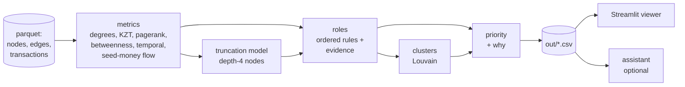
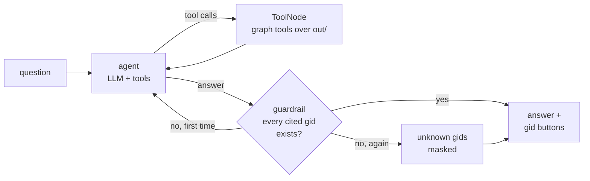

# Money graph

Team ker1mGo, case «Граф денег». From a 4-hop graph of outgoing transfers starting at 81 known couriers (seeds),
we assign each of the 2,248 clients a role, group them into clusters, and rank **who an AML analyst should look at first, and why**.

Everything we output is a hypothesis to check. It is not a statement that anyone is guilty.

## Quickstart

```bash
python3.12 -m venv .venv && source .venv/bin/activate
pip install -r requirements.txt
make run      # project_docs/data -> out/  (under a minute, offline)
make app      # viewer on http://localhost:8501
```

`make run` is the same as `python -m moneygraph.run --data project_docs/data --out out`.
`make test` checks the outputs (row count, schema, evidence, clusters, top list, runtime, no hardcoded gids).

Optional assistant: `cp .env.example .env` and set `OPENAI_API_KEY` (and `OPENAI_MODEL`, `OPENAI_BASE_URL` for any
OpenAI-compatible endpoint). The pipeline and viewer work without it.

## How it works



Each step is a module in `moneygraph/` with one function `compute(ctx)` that returns columns keyed by `gid`;
`run.py` merges them. Every threshold and weight is in [`moneygraph/config.yaml`](moneygraph/config.yaml), with the reason for each value.

## Outputs

| File | Contents |
|---|---|
| `out/nodes_roles.csv` | `gid, role, role_score, cluster_id, priority_score, evidence` + `role_detail, secondary_roles, depth, is_seed` (2,248 rows) |
| `out/clusters.csv` | `cluster_id, n_nodes, n_seed, sum_kzt_internal, top_gids, hypothesis` + `dominant_roles, seed_flow_in` |
| `out/top_nodes.csv` | `rank, gid, role, priority_score, why` + `cluster_id, evidence` (top 30) |
| `out/features.parquet` | every computed metric per node (used by the viewer and assistant) |
| `out/resilience.csv` | largest component, number of components and seed flow left after removing the top-N by each strategy |
| `out/data_requests.csv` | `gid, reason, suggested_request`: what extra data would resolve each gap (hop 5 for likely forwarders, seed inflows, ...) |
| `out/truncation_model.json` | depth-4 model: features, CV AUC, coefficients, observed vs predicted forwarding rate |
| `out/agent_eval.csv` | assistant eval (`make eval`, needs a key): question, expected vs cited gids, recall, precision, unknown gids |

## Roles

<!-- roles and truncation model: section from track A goes here -->

## Clusters

Louvain community detection (`networkx`, `seed=42`, resolution 1.0) on the **undirected** projection of the graph.
Transfers in both directions between two clients become one edge with weight `log1p(total KZT)`, so a handful of
large transfers doesn't outweigh many small ones.

Undirected is a deliberate simplification: modularity is defined for undirected graphs and we want "who is
connected to whom", not flow direction. Direction is used everywhere else (roles, seed-money flow, priority).

Nodes with no transfers at all (19 seeds) get `cluster_id = 0`. On this data we get 44 communities plus cluster 0,
8 of them with more than one seed, identical across runs.

Each cluster gets a hypothesis from the first matching template (thresholds in config):

| Template | When |
|---|---|
| possible collection cell | has a consolidator and ≥ 2 seeds |
| possible payout network | has a distributor |
| possible layering chain | ≥ 30% of nodes are transit |
| likely end-recipient periphery | ≥ 60% of nodes are terminal |
| loosely linked group | otherwise |

## Priority

The question is "who to look at first". Priority favours nodes that **seed money actually reaches**, that play an
active role, and whose removal would cut the flow, over nodes that are just big.

```
priority = seed_factor × Σ weight_k × pct_k        then rescaled so the top node = 1
```

`pct_k` is the percentile rank of each component over all 2,248 nodes, with zero kept at zero
(so the ~1,650 nodes with no betweenness don't get 0.5 for it).

| Component | Weight | What it measures |
|---|---|---|
| `seed_flow` | 0.30 | log KZT of seed-originated money reaching the node (6 rounds of propagation, each node forwards at most its own outflow) |
| `role` | 0.25 | role weight × role_score; coordinator 1.0, consolidator 0.9, distributor 0.8, transit 0.6, terminal 0.5, peripheral 0.1 |
| `seed_sources` | 0.15 | number of seeds with a directed path to the node |
| `betweenness` | 0.15 | directed betweenness: sits on paths between others |
| `removal_impact` | 0.15 | share of seed flow to everyone else that disappears if the node is removed. Rerunning the flow is expensive, so it's computed for the top 100 by the other four components and ranked among those; everyone else gets 0 |

`seed_factor = 0.85` for seeds: they are already known and the case asks us to look beyond them. With current weights
there are no seeds in the top 30.

Each node's `prio_components` column holds the weighted contributions as JSON (the viewer draws them as a bar chart), and
`why` puts the top 3 into words, e.g.
`875k KZT of seed money flows in; consolidator (role score 0.78); reachable from 11 seeds`.

The top 30 currently has 9 transit nodes, 8 consolidators, 7 coordinators, 6 distributors and no seeds.

### Resilience check

`out/resilience.csv` removes the top N nodes (N = 0, 5, 10, 20, 50) chosen four ways, and measures the largest
weakly connected component, the number of components, and the share of seed flow that still reaches depth ≥ 2.

| Removed 50 by | largest component | components | seed flow left |
|---|---|---|---|
| nothing | 1,877 | 35 | 100% |
| priority | 1,449 | 275 | 60% |
| degree | 620 | 1,015 | 22% |
| degree, seeds excluded | 1,049 | 730 | 85% |
| random (mean of 5) | 1,794 | 63 | 94% |

Plain degree wins, and we're reporting that as it is. It wins for two reasons. First, 8 of the 50 highest-degree nodes
are seeds, and removing a seed removes the money's source, which is not a finding. Second, the 60–116-recipient
fan-out hubs leave hundreds of single nodes behind when removed, so the graph breaks up without much money moving.
With seeds excluded, priority cuts seed flow much faster than degree (60% left vs 85%) but breaks the graph up less.
That's the trade-off we chose: priority follows the money, not the shape of the network.

## Assistant

An optional chat tab in the viewer for questions like «кто собирает деньги с этих пятерых: …». It only reads
`out/` through graph tools. It never assigns roles or priorities, and every gid it cites is checked against the graph.

**Enable it:** `cp .env.example .env`, set `OPENAI_API_KEY`, and optionally `OPENAI_MODEL` (default `gpt-4.1-mini`)
and `OPENAI_BASE_URL` for any OpenAI-compatible endpoint. Without a key the tab shows a notice and the rest of the app works.
From the terminal: `python -m agent.graph "<question>"`.



A LangGraph `StateGraph` with at most 8 agent steps. At the last step it has to answer from the tool results it already has.
The prompt allows tool results only, full gids, hypothesis wording, no personal data, and a reply in the question's language.

| Tool | Returns |
|---|---|
| `get_node` | role, evidence, priority and its components, degrees, KZT, seed flow, flags |
| `neighbors` | direct payers / recipients with KZT, top 25 plus totals |
| `paths_between` | directed transfer paths between two gids, up to 4 hops |
| `common_collectors` | who receives from ≥ 2 of a group of gids, with KZT paid straight from the group |
| `top_nodes` | highest priority, optionally by role or without seeds |
| `cluster_summary` | size, seeds, internal KZT, top gids, hypothesis |
| `resilience` | the removal comparison above |
| `tx_timeline` | daily in vs out KZT |

The tools live in `agent/tools.py` over `agent/store.py`, whose pure query functions are also used by the viewer and
tested without an LLM (`tests/test_store.py`, including the guardrail with a scripted model). gids are passed as strings
everywhere, because 18 digits don't survive as JSON floats.

**Guardrail:** after the agent answers, every 15–20 digit number in the answer is looked up. If one isn't a known gid,
the agent is told which ones and rewrites once. If an unknown gid is still there, it is replaced with `[unknown gid]`.

**Eval** (`make eval` → `out/agent_eval.csv`): 10 questions in Russian and English, generated from the graph with a
fixed seed, nothing hand-picked. They cover a group's shared collector, a shared recipient of two clients, payers,
recipients, the biggest recipient, the top 5 and top 3 non-seeds, the middle of a two-hop path, and a cluster's top clients.
The expected gids are computed from the store.

| gid recall | precision | unknown gids | time per question |
|---|---|---|---|
| 1.00 | 0.84 | 0 | ~3 s |

Recall is 10/10. Precision counts cited gids that were neither expected nor in the question, and it is lower only on
the two "shared collector" questions: the agent names the collector paid by all five first, then also lists real partial
collectors paid by 3–4 of them.

**Tracing:** set `LANGFUSE_PUBLIC_KEY`, `LANGFUSE_SECRET_KEY` and `LANGFUSE_BASE_URL` (or `LANGFUSE_HOST`), and each
question becomes a Langfuse trace. The trace shows every graph node, tool call and LLM generation, with tokens and latency.
Without the keys tracing is off and nothing else changes.

## Data limitations and how we handle them

| Limitation (from the task) | What we do |
|---|---|
| Crawl stops at hop 4: 444 depth-4 nodes have no outgoing transfers | Never called a terminal on that basis alone. A model trained on depth 1–3 predicts whether each one forwards money; only low-probability ones become `terminal_inferred`, the rest are `peripheral` with `truncated_*` detail |
| Only outgoing transfers were crawled | Balances are never computed; we use distinct payers/recipients and time-aware pass-through instead of a net balance |
| Seed inflow is under-counted | Seeds never use `in_kzt` or `pass_through`; `pass_through` is NaN for seeds |
| 5,000 KZT threshold | Structuring below it is invisible; we flag amounts near the threshold and say so in the limitations |
| 19 seeds missing from edges, 12 only receive | These 31 seeds get `peripheral / seed_no_outgoing`; the 19 with no edges go to cluster 0; all are listed in `data_requests.csv` |
| 16 weakly connected components | Clusters and resilience are computed per graph, not assuming one network; small components are listed for follow-up |
| No client attributes | Only structure, amounts and dates are used; nothing is inferred about people |
| No ground-truth roles | Rules are explicit and documented; we check them for internal consistency (percentiles, stability) instead of accuracy |

## Limitations of the approach

- **Nothing here is a verdict.** Roles, clusters and priorities are hypotheses for an analyst to check, built only from transfer structure, amounts and dates.
- **No ground truth.** Thresholds come from the data's percentiles and the task's hints (all in `config.yaml` with reasons). They are explainable, not validated.
- **The graph is a sample around 81 seeds.** Anything that looks central is central *within this crawl*; nodes near the edge (depth 4) are under-observed by construction.
- **Seed flow is an approximation.** Money is split by KZT share and capped at each node's outflow; we can't tell which incoming tenge became which outgoing tenge.
- **Undirected clusters.** Louvain ignores direction; two groups that only exchange money one way can still merge.
- **Priority ≠ disruption.** The resilience check shows degree breaks up the graph faster; priority is tuned to where seed money goes, not to graph shape.
- **Below 5,000 KZT is invisible**, so structuring under the threshold can't be seen at all.
- **Truncation model** is trained on depth 1–3 and applied to depth 4, assuming those nodes behave alike; see its AUC and coefficients in `out/truncation_model.json`.

## Scaling to ~1M nodes

At 2,248 nodes everything runs in memory with pandas and networkx in about 10 s. At ~1M nodes and tens of millions of transfers:

| Now | At ~1M nodes |
|---|---|
| pandas | Polars or DuckDB for loading and per-node aggregates (out-of-core, columnar) |
| networkx graph | igraph / graph-tool on one machine; GraphFrames (Spark) if it has to be distributed |
| exact betweenness | sampled betweenness (k source nodes), or drop it in favour of seed-flow metrics |
| Louvain | Leiden (igraph / `leidenalg`): faster and gives well-connected communities |
| seed flow | already a sparse matrix–vector product: the same code, 6 SpMVs over a CSR matrix |
| removal impact for top 100 | same idea, still top-K only; or approximate with the flow through the node |
| BFS per seed for `n_seed_sources` | one multi-source BFS with bitsets per seed, or HyperLogLog counters |
| full recompute | incremental: new transfers update aggregates and only re-propagate from affected nodes; the crawl extends one hop at a time where `data_requests.csv` points |
| pyvis viewer | WebGL (sigma.js / cosmograph); show ego graphs and clusters, never the whole graph |
