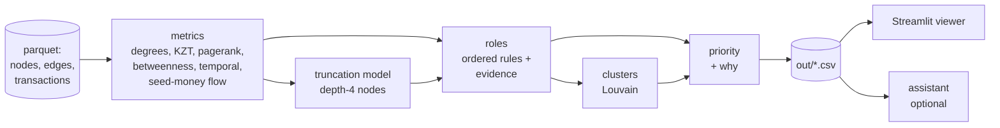
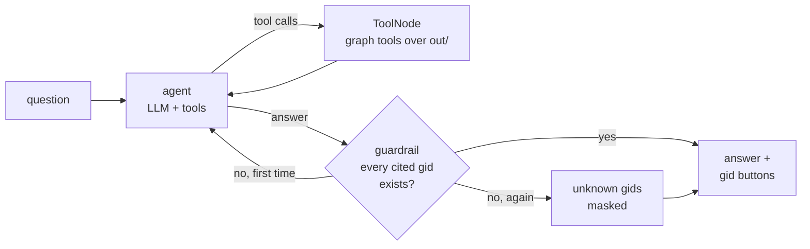
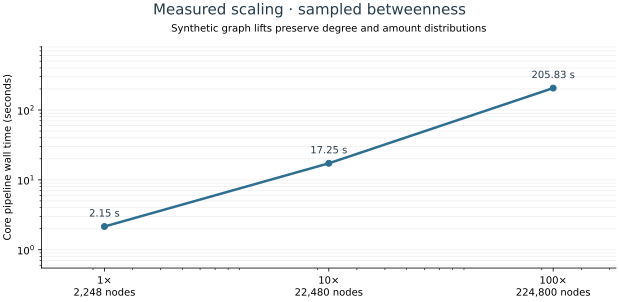

# Money graph

**Follow money from known seeds, inspect the evidence, and choose the next data request.**

Team ker1mGo, case «Граф денег». Our case desk turns a four-hop crawl from 81 known couriers into
explainable role hypotheses, communities and a review order for 2,248 clients. Every finding is a hypothesis
for an analyst to check, never an accusation.


What makes this approach useful:

- **Seed-money attribution.** A KZT-weighted, outflow-capped propagation estimates where seed-originated money reaches.
  Priority combines that evidence with roles, source convergence and removal impact; PageRank alone does not decide the queue.
- **Honest treatment of the crawl boundary.** An inbound-only forwarding model learns from depths 1–3 and distinguishes
  observed terminal-role hypotheses from inferred ones at depth 4.
- **A ranking that can be challenged.** Resilience compares priority with degree, degree excluding seeds, and random removal.
  We show where degree wins and where priority cuts more seed-money flow.
- **Action after uncertainty.** Exported data requests identify the next outgoing crawl, missing seed inflows and small components to inspect.
- **A guarded optional assistant.** Graph tools, identifier checks and an evaluation generated from the current graph support natural-language investigation.
  The pipeline and complete viewer work without a model connection.

| Naive interpretation | Our treatment |
|---|---|
| No observed outflow means terminal | 444 depth-4 sinks have **unverified** outflow; their outgoing transfers were never crawled |
| Every terminal label means the same thing | 1,071 observed and 62 inferred terminal-role hypotheses remain visibly distinct |
| Largest degree is the best review order | Compare disruption and seed-money reach before choosing a priority strategy |
| A score is enough | Open the rule trace, nearest missed rule, priority contributions and seed-money path evidence |

## Quickstart

```bash
python3.12 -m venv .venv && source .venv/bin/activate
pip install -r requirements.txt
make run      # project_docs/data -> out/ (offline)
make test     # output contracts, analytical invariants and page smoke tests
make app      # viewer: open http://localhost:8501 (no browser tab opens by itself)
```

Needs Python 3.12 and `make`. Installation downloads dependencies; the pipeline itself runs offline.
All direct dependency versions, including Streamlit 1.64, are pinned in `requirements.txt`.

`make run` is the same as `python -m moneygraph.run --data project_docs/data --out out`.
`make test` checks the outputs (row count, schema, evidence, clusters, top list, runtime, no hardcoded gids).

Optional assistant: `cp .env.example .env` and set `OPENAI_API_KEY` (and `OPENAI_MODEL`, `OPENAI_BASE_URL` for any
OpenAI-compatible endpoint). The pipeline and viewer work without it.

## Run with Docker

Requires Docker Engine and Docker Compose v2.24 or newer (for optional environment files).

```bash
docker compose up
```

Open **http://localhost:8501** once the app reports healthy. On first launch Compose builds the
`python:3.12-slim` image and downloads pinned dependencies. Both services run as an unprivileged user.
The `pipeline` service has networking disabled, writes a shared `outputs` volume, then exits successfully.
Only then does `app` start; it reads the volume and its `/_stcore/health` endpoint is checked every 10 seconds.
No `.env`, GPU or paid service is required.

```bash
docker compose ps -a               # pipeline: exited (0); app: healthy
docker compose logs pipeline       # timings and output counts
docker compose down                # stop; preserve outputs
```

After changing code, use `docker compose up --build`. Use `MONEYGRAPH_PORT=8502 docker compose up`
if port 8501 is occupied. To change data, replace the three files in `project_docs/data/`, then rebuild;
the next pipeline run refreshes the outputs. The host `out/` and Docker's named volume are separate.
For optional chat, copy `.env.example` to `.env` and set the model connection; that file is passed only to
`app`, is excluded from the image, and is never required by the pipeline. `make run` and `make app` remain
available for local use without Docker.

## A five-minute case walkthrough

1. **Case overview:** read the scope and boundary caveats, then open the first review candidate.
2. **Investigate:** search any part of a gid, focus a client, expand one or two hops, and follow transfer arrows.
   Open the dossier's role conditions, priority contributions and estimated seed-money paths.
3. **Clusters and Priorities:** compare group hypotheses and inspect why a client enters the review queue.
4. **Data gaps:** export requests for the next crawl instead of treating missing outflow as a finding.
5. **Method & scale:** inspect truncation validation, resilience, measured runtime and configuration provenance.
   The **Assistant** page is optional; every other page works without a key.

## How it works



Each step is a module in `moneygraph/` with one function `compute(ctx)` that returns columns keyed by `gid`;
`run.py` merges them. Every threshold and weight is in [`moneygraph/config.yaml`](moneygraph/config.yaml), with the reason for each value.

## Outputs

The outputs of the current `main` are committed in [`out/`](out/). The pipeline is deterministic (fixed seeds), so
`make run` reproduces the required CSVs byte for byte. Parquet evidence and explanation files are also committed
as a ready-to-open case snapshot and rebuilt by `make run`; timing and environment metadata naturally vary by machine.
The app and assistant read only `out/`.

| File | Contents |
|---|---|
| `out/nodes_roles.csv` | `gid, role, role_score, cluster_id, priority_score, evidence` + `role_detail, secondary_roles, depth, is_seed` (2,248 rows) |
| `out/clusters.csv` | `cluster_id, n_nodes, n_seed, sum_kzt_internal, top_gids, hypothesis` + `dominant_roles, seed_flow_in` |
| `out/top_nodes.csv` | `rank, gid, role, priority_score, why` + `cluster_id, evidence` (top 30) |
| `out/features.parquet` | every computed metric per node (used by the viewer and assistant) |
| `out/edges.parquet`, `out/transactions.parquet` | exported transfer evidence for the viewer and assistant |
| `out/rule_traces.json`, `out/seed_paths.json` | configured condition traces and estimated seed-money paths for dossiers |
| `out/pipeline_metadata.json` | thresholds, weights, run settings and measured step timings |
| `out/bench.csv`, `out/bench.svg` | reproducible scale measurements and chart (`make bench`) |
| `out/resilience.csv` | largest component, number of components and seed flow left after removing the top-N by each strategy |
| `out/data_requests.csv` | `gid, reason, suggested_request`: what extra data would resolve each gap (hop 5 for likely forwarders, seed inflows, ...) |
| `out/truncation_model.json` | depth-4 model: features, CV AUC, coefficients, observed vs predicted forwarding rate |
| `out/agent_eval.csv` | assistant eval (`make eval`, needs a key): question, expected vs cited gids, recall, precision, unknown gids |

## Roles

Every client gets exactly one role from ordered, documented rules. The rules are checked top to bottom and the first match wins;
any other rules that also match are listed in `secondary_roles`. Thresholds live in `moneygraph/config.yaml`, each with its reason.

| # | Role | Rule (final thresholds) | Why |
|---|---|---|---|
| 1 | **coordinator** | (pays ≥ 2 distinct seeds, or on cycles of length ≤ 4 with ≥ 2 seeds) and (reachable from ≥ 2 seeds, or betweenness ≥ p98) | sends money back into several known couriers while sitting between seed flows. At "≥ 1 seed" the rule matched 67 nodes, because 73% of nodes are reachable from ≥ 2 seeds; at 2 it gives 22 |
| 2 | **distributor** | out_deg ≥ 10 and out_deg ≥ 3 × max(in_deg, 1) | fan-out: few sources, many recipients (hubs up to 116 recipients) |
| 3 | **consolidator** | in_deg ≥ 5 and (pass_through ≤ 0.5 or out_deg ≤ in_deg / 3) | many distinct payers, few exits. in_deg ≥ 5 is p98 |
| 4 | **transit** | non-seed, in ≥ 1, out ≥ 1, and (0.8 ≤ pass_through ≤ 1.2, or ≥ 50% of inflow forwarded within 2 days while pass_through ≤ 2) | passes money on without holding it. Above pass_through 2, most outflow comes from outside the graph, so fast forwarding alone is not enough |
| 5 | **terminal** | out = 0, in ≥ 1, and depth ≤ 3 (`terminal_observed`), or depth 4 with P(forwards) < 0.3 (`terminal_inferred`) | the crawl checked outgoing transfers of every depth 1–3 node, so a sink there is observed; at depth 4 it can only be inferred |
| 6 | **peripheral** | everything else: `truncated_unknown`, `truncated_likely_forwarding` (P > 0.6), `seed_no_outgoing`, `no_edges`, `weak_signal` | stays inside the role dictionary while being honest about gaps |

Seeds never use `in_kzt` or `pass_through`: their inflow is under-counted because the graph was crawled from them.
Fast pass-through is matched FIFO: each incoming transfer is matched by outgoing transfers within 2 days.

**role_score**: for each threshold condition, `m = clip((x - thr) / thr, 0, 1)` (the inverse for ≤ conditions), then `0.5 + 0.5 × mean(m)`.
`terminal_observed` = 0.9, `terminal_inferred` = 1 − P(forwards), `peripheral` = 1 − the node's best partial match to a structural role.

**evidence**: at most 200 characters, always with numbers, worded as a hypothesis, e.g.
`8 payers (2 seeds) → 2.16M in; sends on 24%; to 2 recipients; up to 7 payers same day; seed money in 875k; flags burst`.

### Role counts (2,248 clients)

| Role | Nodes | Share | By detail |
|---|---:|---:|---|
| terminal | 1,133 | 50.4% | 1,071 observed · 62 inferred |
| peripheral | 907 | 40.3% | 494 weak signal (94 of them fast forwarders above the pass-through cap) · 350 truncated unknown · 32 truncated likely forwarding · 31 seeds without outgoing |
| transit | 107 | 4.8% | |
| distributor | 50 | 2.2% | |
| consolidator | 29 | 1.3% | |
| coordinator | 22 | 1.0% | |

## Truncation

The crawl stopped at depth 4, so for the 444 depth-4 clients we can't see whether they send money on. Treating them all as end recipients
would be wrong: 35% / 42% / 36% of depth 1 / 2 / 3 clients do forward money.

We train a logistic regression (`StandardScaler` + `LogisticRegression(class_weight="balanced")`) on the **1,723 non-seed depth 1–3 clients with inflow**,
where outgoing transfers were crawled, with the label "has outgoing transfers". It uses **inbound-only** features, so the same inputs exist at depth 4,
and no depth feature. Payer role is not available at this step, so payer out-degree and pass-through stand in for it.

**5-fold stratified CV AUC: 0.733** (the trust threshold is 0.6; below it every depth-4 sink would stay `truncated_unknown`).

| Feature (standardized) | Coefficient |
|---|---:|
| mean incoming transfer (log) | −0.955 |
| distinct payers (in_deg) | +0.701 |
| largest incoming transfer (log) | +0.658 |
| payers' mean out-degree (log) | −0.371 |
| max payers on one day | −0.349 |
| days with incoming transfers | +0.326 |
| total inflow KZT (log) | +0.267 |
| payers' mean pass-through | +0.147 |
| share of round (10k) amounts | +0.071 |
| incoming transfer count | −0.019 |
| payers that are seeds | −0.015 |

Reading: clients paid by several payers over several days tend to send money on; a high average transfer, or payers who themselves
pay many people (a payout hub), points to an end recipient.

**Calibration.** Balanced class weights train as if forwarding were 50/50, so we shift the logit back by the observed base rate
(log-odds −0.516). Ranking and AUC are unchanged. **Mean P(forwards) at depth 4 = 0.41, vs an observed base rate of 0.37 at depths 1–3**,
so about 183 of 444 depth-4 clients likely forward money. With P < 0.3 → `terminal_inferred` (62), P > 0.6 → `truncated_likely_forwarding` (32),
and the rest (350) stay `truncated_unknown`. Likely forwarders are the candidates for a hop-5 data request (`data_requests.csv`).
Full model output: `out/truncation_model.json`.

## Clusters

Louvain community detection (`networkx`, `seed=42`, resolution 1.0) on the **undirected** projection of the graph.
Transfers in both directions between two clients become one edge with weight `log1p(total KZT)`, so a handful of
large transfers doesn't outweigh many small ones.

Undirected is a deliberate simplification: modularity is defined for undirected graphs and we want "who is
connected to whom", not flow direction. Direction is used everywhere else (roles, seed-money flow, priority).

Nodes with no transfers at all (19 seeds) get `cluster_id = 0`. On this data we get 44 communities plus cluster 0,
8 of them with more than one seed, identical across runs.

Each cluster gets a hypothesis from the first matching template (thresholds in config):

| Template | When |
|---|---|
| possible collection cell | has a consolidator and ≥ 2 seeds |
| possible payout network | has a distributor |
| possible layering chain | ≥ 30% of nodes are transit |
| likely end-recipient periphery | ≥ 60% of nodes are terminal |
| loosely linked group | otherwise |

## Priority

The question is "who to look at first". Priority favours nodes that **seed money actually reaches**, that play an
active role, and whose removal would cut the flow, over nodes that are just big.

```
priority = seed_factor × Σ weight_k × pct_k        then rescaled so the top node = 1
```

`pct_k` is the percentile rank of each component over all 2,248 nodes, with zero kept at zero
(so the ~1,650 nodes with no betweenness don't get 0.5 for it).

| Component | Weight | What it measures |
|---|---|---|
| `seed_flow` | 0.30 | log KZT of seed-originated money reaching the node (6 rounds of propagation, each node forwards at most its own outflow) |
| `role` | 0.25 | role weight × role_score; coordinator 1.0, consolidator 0.9, distributor 0.8, transit 0.6, terminal 0.5, peripheral 0.1 |
| `seed_sources` | 0.15 | number of seeds with a directed path to the node |
| `betweenness` | 0.15 | directed betweenness: sits on paths between others |
| `removal_impact` | 0.15 | share of seed flow to everyone else that disappears if the node is removed. Rerunning the flow is expensive, so it's computed for the top 100 by the other four components and ranked among those; everyone else gets 0 |

`seed_factor = 0.85` for seeds: they are already known and the case asks us to look beyond them. With current weights
there are no seeds in the top 30.

Each node's `prio_components` column holds the weighted contributions as JSON (the viewer shows a waterfall), and
`why` puts the top 3 into words, e.g.
`875k KZT of seed money flows in; consolidator (role score 0.78); reachable from 11 seeds`.

### Open the evidence behind a score

The Investigate dossier shows each condition of the selected role with its measured value, configured threshold and
pass/fail result, plus the nearest rule the client did not match and its shortfall. The pipeline exports these traces
from the same predicates and configuration that assign roles; the viewer does not recreate the rules.

Priority contributions form a waterfall from the weighted components through the seed adjustment and score normalization.
Estimated seed-money paths show where attributed funds came from, ranked by KZT. They are modelled allocations over
observed transfers, not proof that particular incoming funds financed a later transfer. A plain-language dossier brings
the role, flows and missing evidence together without requiring the optional assistant.

The top 30 currently has 9 transit nodes, 8 consolidators, 7 coordinators, 6 distributors and no seeds.

### Resilience check

`out/resilience.csv` removes the top N nodes (N = 0, 5, 10, 20, 50) chosen four ways, and measures the largest
weakly connected component, the number of components, and the share of seed flow that still reaches depth ≥ 2.

| Removed 50 by | largest component | components | seed flow left |
|---|---|---|---|
| nothing | 1,877 | 35 | 100% |
| priority | 1,449 | 275 | 60% |
| degree | 620 | 1,015 | 22% |
| degree, seeds excluded | 1,049 | 730 | 85% |
| random (mean of 5) | 1,794 | 63 | 94% |

Plain degree wins, and we're reporting that as it is. It wins for two reasons. First, 8 of the 50 highest-degree nodes
are seeds, and removing a seed removes the money's source, which is not a finding. Second, the 60–116-recipient
fan-out hubs leave hundreds of single nodes behind when removed, so the graph breaks up without much money moving.
With seeds excluded, priority cuts seed flow much faster than degree (60% left vs 85%) but breaks the graph up less.
That's the trade-off we chose: priority follows the money, not the shape of the network.

## Assistant

An optional Assistant page in the viewer for questions like «кто собирает деньги с этих пятерых: …». It only reads
`out/` through graph tools. It never assigns roles or priorities, and every gid it cites is checked against the graph.

**Enable it:** `cp .env.example .env`, set `OPENAI_API_KEY`, and optionally `OPENAI_MODEL` (default `gpt-4.1-mini`)
and `OPENAI_BASE_URL` for any OpenAI-compatible endpoint. Without a key the page shows a notice and the rest of the app works.
From the terminal: `python -m agent.graph "<question>"`.



A LangGraph `StateGraph` with at most 8 agent steps. At the last step it has to answer from the tool results it already has.
The prompt allows tool results only, full gids, hypothesis wording, no personal data, and a reply in the question's language.

| Tool | Returns |
|---|---|
| `get_node` | role, evidence, priority and its components, degrees, KZT, seed flow, flags |
| `neighbors` | direct payers / recipients with KZT, top 25 plus totals |
| `paths_between` | directed transfer paths between two gids, up to 4 hops |
| `common_collectors` | who receives from ≥ 2 of a group of gids, with KZT paid straight from the group |
| `top_nodes` | highest priority, optionally by role or without seeds |
| `cluster_summary` | size, seeds, internal KZT, top gids, hypothesis |
| `resilience` | the removal comparison above |
| `tx_timeline` | daily in vs out KZT |

The tools live in `agent/tools.py` over `agent/store.py`, whose pure query functions are also used by the viewer and
tested without an LLM (`tests/test_store.py`, including the guardrail with a scripted model). gids are passed as strings
everywhere, because 18 digits don't survive as JSON floats.

**Guardrail:** after the agent answers, every 15–20 digit number in the answer is looked up. If one isn't a known gid,
the agent is told which ones and rewrites once. If an unknown gid is still there, it is replaced with `[unknown gid]`.

**Eval** (`make eval` → `out/agent_eval.csv`): 10 questions in Russian and English, generated from the graph with a
fixed seed, nothing hand-picked. They cover a group's shared collector, a shared recipient of two clients, payers,
recipients, the biggest recipient, the top 5 and top 3 non-seeds, the middle of a two-hop path, and a cluster's top clients.
The expected gids are computed from the store.

**Previously recorded evaluation** (not rerun by the offline pipeline; `make eval` writes a fresh record):

| gid recall | precision | unknown gids | time per question |
|---|---|---|---|
| 1.00 | 0.84 | 0 | ~3 s |

Recall is 10/10. Precision counts cited gids that were neither expected nor in the question, and it is lower only on
the two "shared collector" questions: the agent names the collector paid by all five first, then also lists real partial
collectors paid by 3–4 of them.

**Tracing:** set `LANGFUSE_PUBLIC_KEY`, `LANGFUSE_SECRET_KEY` and `LANGFUSE_BASE_URL` (or `LANGFUSE_HOST`), and each
question becomes a Langfuse trace. The trace shows every graph node, tool call and LLM generation, with tokens and latency.
Without the keys tracing is off and nothing else changes.

## Data limitations and how we handle them

| Limitation (from the task) | What we do |
|---|---|
| Crawl stops at hop 4: 444 depth-4 nodes have no outgoing transfers | Never called a terminal on that basis alone. A model trained on depth 1–3 predicts whether each one forwards money; only low-probability ones become `terminal_inferred`, the rest are `peripheral` with `truncated_*` detail |
| Only outgoing transfers were crawled | Balances are never computed; we use distinct payers/recipients and time-aware pass-through instead of a net balance |
| Seed inflow is under-counted | Seeds never use `in_kzt` or `pass_through`; `pass_through` is NaN for seeds |
| 5,000 KZT threshold | Structuring below it is invisible; we flag amounts near the threshold and say so in the limitations |
| 19 seeds missing from edges, 12 only receive | These 31 seeds get `peripheral / seed_no_outgoing`; the 19 with no edges go to cluster 0; all are listed in `data_requests.csv` |
| 16 connected components with edges, plus 19 isolated seeds | Clusters and resilience include all 35 weak components; small components are listed for follow-up |
| No client attributes | Only structure, amounts and dates are used; nothing is inferred about people |
| No ground-truth roles | Rules are explicit and documented; we check them for internal consistency (percentiles, stability) instead of accuracy |

## Limitations of the approach

- **Nothing here is a verdict.** Roles, clusters and priorities are hypotheses for an analyst to check, built only from transfer structure, amounts and dates.
- **No ground truth.** Thresholds come from the data's percentiles and the task's hints (all in `config.yaml` with reasons). They are explainable, not validated.
- **The graph is a sample around 81 seeds.** Anything that looks central is central *within this crawl*; nodes near the edge (depth 4) are under-observed by construction.
- **Seed flow is an approximation.** Money is split by KZT share and capped at each node's outflow; we can't tell which incoming tenge became which outgoing tenge.
- **Undirected clusters.** Louvain ignores direction; two groups that only exchange money one way can still merge.
- **Priority ≠ disruption.** The resilience check shows degree breaks up the graph faster; priority is tuned to where seed money goes, not to graph shape.
- **Below 5,000 KZT is invisible**, so structuring under the threshold can't be seen at all.
- **Truncation model** is trained on depth 1–3 and applied to depth 4, assuming those nodes behave alike; see its AUC and coefficients in `out/truncation_model.json`.

## Measured scale

```bash
make bench   # equivalent to python -m moneygraph.bench --data project_docs/data --out out
# For the Docker output volume instead:
docker compose run --rm pipeline python -m moneygraph.bench
```

The benchmark creates seeded graph lifts at ×1, ×10 and ×100. Incoming/outgoing degree distributions and transfer
amounts follow the supplied data; this measures computational cost, not accuracy on a larger investigation.
`out/bench.csv` records per-step wall-clock seconds, graph sizes, mode and distribution checks.
The production pipeline retains exact metrics at the supplied case size; larger benchmark runs use explicitly labelled
sampled betweenness. Comparing those modes as if they were the same algorithm would be misleading.
Timing includes the seven analytical steps, summaries, resilience and core file exports, including graph construction and
integrity checks. Interactive explanation JSON, input parquet copies and UI rendering are excluded; full case timings are
recorded separately in `out/pipeline_metadata.json`.



| Mode | Nodes | Transfers | Core pipeline |
|---|---:|---:|---:|
| Exact centrality, ×1 | 2,248 | 4,840 | 4.90 s |
| Sampled betweenness (32 sources), ×1 | 2,248 | 4,840 | 2.15 s |
| Sampled betweenness (32 sources), ×10 | 22,480 | 48,400 | 17.25 s |
| Sampled betweenness (32 sources), ×100 | 224,800 | 484,000 | 205.83 s |

Recorded on an Intel Core i5-10200H (8 logical CPUs, 15.32 GiB RAM), Linux x86-64,
Python 3.12.12, one BLAS thread and one run per setting; see
[`out/bench_metadata.json`](out/bench_metadata.json) for the full environment and workload description.
The optimized temporal step takes **0.036 s versus 5.070 s** for the previous implementation at ×1
(about **140× faster**, with identical temporal outputs verified by the benchmark).
The larger run also exposed repeated component decomposition in cycle detection; bounded local walks now preserve
the exact short-cycle calculation without that bottleneck. At ×100, the remaining largest steps are resilience
(56.91 s), priority (47.68 s) and role assignment (46.64 s), which identifies where the next optimization effort belongs.

The **Method & scale** page displays the same artifact and per-step measurements, with environment and mode details.
The recorded chart is evidence from one machine, not a promise about other hardware or real-world graph topology.
Benchmark outputs are a separate snapshot: rerun `make bench` (or the Docker command above) after replacing input data;
`make run` refreshes case evidence without rerunning the scale experiment.

### Next scale step: ~1M nodes

Million-node performance has **not** been measured. These are engineering directions to validate next:


| Now | At ~1M nodes |
|---|---|
| pandas | Polars or DuckDB for loading and per-node aggregates (out-of-core, columnar) |
| networkx graph | igraph / graph-tool on one machine; GraphFrames (Spark) if it has to be distributed |
| exact betweenness | sampled betweenness (k source nodes), or drop it in favour of seed-flow metrics |
| Louvain | Leiden (igraph / `leidenalg`): faster and gives well-connected communities |
| seed flow | already a sparse matrix–vector product: the same code, 6 SpMVs over a CSR matrix |
| removal impact for top 100 | same idea, still top-K only; or approximate with the flow through the node |
| BFS per seed for `n_seed_sources` | one multi-source BFS with bitsets per seed, or HyperLogLog counters |
| full recompute | incremental: new transfers update aggregates and only re-propagate from affected nodes; the crawl extends one hop at a time where `data_requests.csv` points |
| offline SVG graph in a Streamlit v2 component | WebGL (sigma.js / cosmograph); keep ego graphs and clusters bounded |
