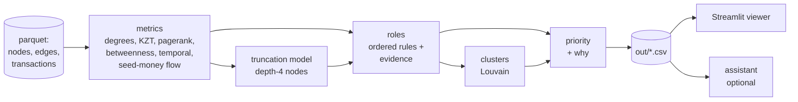

# Money graph

Team ker1mGo, case «Граф денег». From a 4-hop graph of outgoing transfers starting at 81 known couriers (seeds),
we assign each of the 2,248 clients a role, group them into clusters, and rank **who an AML analyst should look at first, and why**.

Everything we output is a hypothesis to check. It is not a statement that anyone is guilty.

## Quickstart

```bash
python3.12 -m venv .venv && source .venv/bin/activate
pip install -r requirements.txt
make run      # project_docs/data -> out/  (under a minute, offline)
make app      # viewer on http://localhost:8501
```

`make run` is the same as `python -m moneygraph.run --data project_docs/data --out out`.
`make test` checks the outputs (row count, schema, evidence, clusters, top list, runtime, no hardcoded gids).

Optional assistant: `cp .env.example .env` and set `OPENAI_API_KEY` (and `OPENAI_MODEL`, `OPENAI_BASE_URL` for any
OpenAI-compatible endpoint). The pipeline and viewer work without it.

## How it works



Each step is a module in `moneygraph/` with one function `compute(ctx)` that returns columns keyed by `gid`;
`run.py` merges them. Every threshold and weight is in [`moneygraph/config.yaml`](moneygraph/config.yaml), with the reason for each value.

## Outputs

| File | Contents |
|---|---|
| `out/nodes_roles.csv` | `gid, role, role_score, cluster_id, priority_score, evidence` + `role_detail, secondary_roles, depth, is_seed` (2,248 rows) |
| `out/clusters.csv` | `cluster_id, n_nodes, n_seed, sum_kzt_internal, top_gids, hypothesis` + `dominant_roles, seed_flow_in` |
| `out/top_nodes.csv` | `rank, gid, role, priority_score, why` + `cluster_id, evidence` (top 30) |
| `out/features.parquet` | every computed metric per node (used by the viewer and assistant) |
| `out/resilience.csv` | what happens to the network if the top-N nodes are removed |

## Roles

<!-- filled in once the role rules are final -->

## Clusters

Louvain community detection (`networkx`, `seed=42`, resolution 1.0) on the **undirected** projection of the graph.
Transfers in both directions between two clients become one edge with weight `log1p(total KZT)`, so a handful of
large transfers doesn't outweigh many small ones.

Undirected is a deliberate simplification: modularity is defined for undirected graphs and we want "who is
connected to whom", not flow direction. Direction is used everywhere else (roles, seed-money flow, priority).

Nodes with no transfers at all (19 seeds) get `cluster_id = 0`. On this data we get 44 communities plus cluster 0,
8 of them with more than one seed, identical across runs.

Each cluster gets a hypothesis from the first matching template (thresholds in config):

| Template | When |
|---|---|
| possible collection cell | has a consolidator and ≥ 2 seeds |
| possible payout network | has a distributor |
| possible layering chain | ≥ 30% of nodes are transit |
| likely end-recipient periphery | ≥ 60% of nodes are terminal |
| loosely linked group | otherwise |

## Priority

<!-- formula, weights, seed factor, removal impact, resilience results -->

## Data limitations and how we handle them

| Limitation (from the task) | What we do |
|---|---|
| Crawl stops at hop 4: 444 depth-4 nodes have no outgoing transfers | Never called a terminal on that basis alone. A model trained on depth 1–3 predicts whether each one forwards money; only low-probability ones become `terminal_inferred`, the rest are `peripheral` with `truncated_*` detail |
| Only outgoing transfers were crawled | Balances are never computed; we use distinct payers/recipients and time-aware pass-through instead of a net balance |
| Seed inflow is under-counted | Seeds never use `in_kzt` or `pass_through`; `pass_through` is NaN for seeds |
| 5,000 KZT threshold | Structuring below it is invisible; we flag amounts near the threshold and say so in the limitations |
| 19 seeds missing from edges, 12 only receive | `role_detail = no_edges / seed_no_outgoing`, cluster 0, listed in `data_requests.csv` |
| 16 weakly connected components | Clusters and resilience are computed per graph, not assuming one network; small components are listed for follow-up |
| No client attributes | Only structure, amounts and dates are used; nothing is inferred about people |
| No ground-truth roles | Rules are explicit and documented; we check them for internal consistency (percentiles, stability) instead of accuracy |

## Limitations of the approach

<!-- -->

## Scaling to ~1M nodes

<!-- -->
