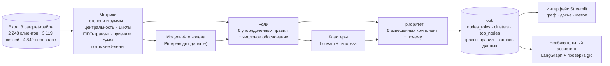

# Граф денег

**Проследить деньги от известных клиентов, проверить доказательства и выбрать следующий запрос данных.**

[English version](README.md)

Команда ker1mGo, кейс «Граф денег». AML-аналитику известен 81 клиент, получавший деньги, связанные с оборотом наркотиков
(*seed-клиенты*), и есть их исходящие переводы на 4 колена: всего 2 248 клиентов. Наш инструмент отвечает на вопрос аналитика
**«кого из этих клиентов смотреть первым и почему?»**. Каждому клиенту присваиваются роль, кластер и приоритет проверки,
и у каждого вывода есть обоснование. Все выводы — гипотезы для проверки аналитиком, а не утверждения о виновности.


**Демо-видео:** [docs/media/demo.webm](docs/media/demo.webm)

**Содержание:** [Запуск](#запуск) · [Как это работает](#как-это-работает) · [Роли и пороги](#роли-и-пороги) ·
[Схемы данных](#схемы-данных) · [Демонстрация](#демонстрация) · [Ограничения](#ограничения) · [Масштабирование](#масштабирование) ·
[Ассистент](#ассистент-опционально) · [Команды](#команды)

## Запуск

Нужны **Python 3.12** и **make** (или Docker, см. ниже). Все команды выполняются из корня репозитория.

**1. Установка**

```bash
python3.12 -m venv .venv
source .venv/bin/activate
pip install -r requirements.txt
```

**2. Настройка (необязательно)**

Пайплайну и интерфейсу настройка не нужна. API-ключ нужен только для необязательной страницы «Ассистент»:

```bash
cp .env.example .env
```

Затем откройте `.env` в любом редакторе и заполните нужное:

```ini
OPENAI_API_KEY=sk-...        # включает «Ассистента»; оставьте пустым, если он не нужен
OPENAI_MODEL=                # пусто = gpt-4.1-mini
OPENAI_BASE_URL=             # пусто = api.openai.com; укажите для любого OpenAI-совместимого сервиса
MONEYGRAPH_PORT=             # только для Docker; пусто = 8501
```

`.env` не попадает в git и не копируется в Docker-образ.

**3. Запуск пайплайна** (одна команда, которая строит результаты)

```bash
make run
```

Команда читает `project_docs/data/`, работает офлайн около 10 секунд и создаёт три обязательных файла:
`out/nodes_roles.csv`, `out/clusters.csv` и `out/top_nodes.csv`, а также материалы для интерфейса.
Результат детерминирован: повторный запуск байт в байт воспроизводит сохранённый в репозитории `out/`
(меняются только замеры времени в `pipeline_metadata.json`).

**4. Интерфейс**

```bash
make app
```

Откройте <http://localhost:8501>.

**Через Docker** вместо шагов 1–4 (шаг 2 при желании выполните заранее):

```bash
docker compose up --build
```

Пайплайн запускается в контейнере без доступа к сети, затем интерфейс открывается на <http://localhost:8501>.
Остановить: `docker compose down`. Подробная инструкция на русском: [docs/quickstart-ru.md](docs/quickstart-ru.md).

## Как это работает



Метод в пяти шагах:

1. **Измеряем каждого клиента.** Число разных плательщиков и получателей, суммы входа и выхода, центральность, короткие циклы,
   какая доля входящих денег уходит дальше в течение двух дней (сопоставление перевод за переводом) и признаки сумм:
   повторяющиеся и круглые суммы.
2. **Следим за деньгами seed-клиентов.** Исходящие переводы seed-клиентов распределяются дальше по связям пропорционально суммам,
   но не больше, чем клиент реально отправил. Так оценивается, сколько seed-денег доходит до каждого клиента и от скольких seed-клиентов.
3. **Учитываем обрыв данных.** Обход остановился на 4-м колене, поэтому у 444 клиентов там не видно исходящих переводов.
   Вместо того чтобы считать их конечными получателями, небольшая логистическая регрессия, обученная на коленах 1–3
   (где исходящие переводы *были* собраны), оценивает, переводит ли каждый из них деньги дальше (AUC на кросс-валидации 0,733).
4. **Присваиваем роли и кластеры.** Шесть упорядоченных задокументированных правил дают каждому клиенту одну роль со скором
   и числовым обоснованием. Алгоритм Louvain разбивает клиентов на кластеры, и для каждого формулируется гипотеза.
5. **Ранжируем для проверки.** Приоритет объединяет дошедшие seed-деньги, роль, число seed-источников, посредничество (betweenness)
   и то, сколько seed-потока пропадает при изъятии клиента. У каждого клиента есть понятное объяснение `why`.

Чем подход отличается от наивного:

| Наивное прочтение | Наш подход |
|---|---|
| Нет исходящих переводов — значит, конечный получатель | Исходящие переводы 444 клиентов 4-го колена не собирались; мы разделяем 1 071 наблюдаемого и 62 предсказанных конечных получателя |
| Порядок проверки — по степени или PageRank | Приоритет следует за реальным движением seed-денег, а проверка устойчивости честно показывает компромисс |
| Достаточно одного скора | Досье клиента показывает каждое условие правила со значением и порогом, ближайшее несработавшее правило, разложение приоритета и пути seed-денег |
| Недостающие данные — просто пробел | `data_requests.csv` говорит, что запросить дальше: переводы 5-го колена, входящие переводы seed-клиентов, мелкие изолированные группы |

Каждый шаг пайплайна в `moneygraph/` реализует `compute(ctx)` и возвращает столбцы по `gid`; `run.py` объединяет их по порядку.
Все пороги и веса хранятся в [`moneygraph/config.yaml`](moneygraph/config.yaml) с объяснением каждого значения.
Пайплайн не зависит ни от интерфейса, ни от ассистента; они только читают `out/`.

## Роли и пороги

Правила проверяются сверху вниз, срабатывает первое подходящее; остальные подходящие правила записываются в `secondary_roles`.

| № | Роль | Правило | Почему |
|---|---|---|---|
| 1 | **coordinator** (координатор) | (платит ≥ 2 разным seed-клиентам или состоит в циклах длиной ≤ 4 с ≥ 2 seed-клиентами) и (достижим из ≥ 2 seed-клиентов или betweenness ≥ p98) | возвращает деньги нескольким известным курьерам и находится между seed-потоками |
| 2 | **distributor** (распределитель) | out_deg ≥ 10 и out_deg ≥ 3 × max(in_deg, 1) | веерная рассылка: мало источников, много получателей (до 116 получателей) |
| 3 | **consolidator** (точка консолидации) | in_deg ≥ 5 и (pass_through ≤ 0,5 или out_deg ≤ in_deg / 3) | много разных плательщиков, мало выходов; in_deg ≥ 5 — это 98-й перцентиль |
| 4 | **transit** (транзит) | не seed, вход ≥ 1, выход ≥ 1 и (0,8 ≤ pass_through ≤ 1,2 или ≥ 50% входа уходит дальше за 2 дня при pass_through ≤ 2) | пропускает деньги дальше, не удерживая |
| 5 | **terminal** (конечный получатель) | выход = 0, вход ≥ 1 и колено ≤ 3 (`terminal_observed`) или колено 4 с P(переводит дальше) < 0,3 (`terminal_inferred`) | исходящие переводы колен 1–3 собраны, поэтому там «сток» наблюдаем; на 4-м колене его можно только предсказать |
| 6 | **peripheral** (периферия) | всё остальное: `truncated_unknown`, `truncated_likely_forwarding` (P > 0,6), `seed_no_outgoing`, `no_edges`, `weak_signal` | остаётся в словаре ролей и честно показывает пробелы в данных |

Для seed-клиентов `in_kzt` и `pass_through` не используются: их входящие суммы занижены из-за способа сбора графа.
`role_score` показывает, насколько клиент превышает пороги: `0,5 + 0,5 × mean(clip((x − thr) / thr, 0, 1))`;
у наблюдаемых конечных получателей 0,9, у предсказанных 1 − P(переводит дальше). Обоснование всегда содержит числа, например:
`8 payers (2 seeds) → 2.16M in; sends on 24%; to 2 recipients; up to 7 payers same day; seed money in 875k; flags burst`.

Результат на предоставленных данных: terminal 1 133 · peripheral 907 · transit 107 · distributor 50 · consolidator 29 · coordinator 22.

**Приоритет** = коэффициент seed × Σ вес × перцентильный ранг, с нормировкой так, чтобы у первого клиента был 1.
Веса: дошедшие seed-деньги 0,30, роль 0,25, число seed-источников 0,15, betweenness 0,15, эффект изъятия 0,15.
Для seed-клиентов коэффициент 0,85, потому что они уже известны; в топ-30 нет ни одного seed-клиента.

Модель 4-го колена, кластеры, приоритет и устойчивость со всеми числами описаны в [docs/methodology.md](docs/methodology.md) (на английском).

## Схемы данных

### Вход (`project_docs/data/`, предоставлено организаторами, не изменяется)

| Файл | Строк | Столбцы |
|---|---:|---|
| `nodes.parquet` | 2 248 | `gid` int64 идентификатор клиента · `depth` int64 колено первого появления (0 = seed) · `is_seed` bool |
| `edges.parquet` | 3 119 | `src` int64 плательщик · `dst` int64 получатель · `sum_kzt` float64 сумма за июль · `n_tx` int64 число переводов · `depth` int8 колено, на котором найдена связь |
| `transactions.parquet` | 4 840 | `src` int64 · `dst` int64 · `date` дата · `sum_kzt` float64 отдельный перевод (≥ 5 000 KZT) |

### Обязательные выгрузки (`out/`)

**`nodes_roles.csv`**: строка на каждого клиента, 2 248 строк.

| Столбец | Тип | Смысл |
|---|---|---|
| `gid` | int64 | идентификатор клиента |
| `role` | str | `coordinator`, `distributor`, `consolidator`, `transit`, `terminal` или `peripheral` |
| `role_score` | float 0–1 | насколько уверенно выполнены пороги роли |
| `cluster_id` | int | кластер; 0 = клиенты без переводов |
| `priority_score` | float 0–1 | приоритет проверки; у первого клиента 1 |
| `evidence` | str ≤ 200 | почему присвоена роль, с числами |
| `role_detail` | str | уточнение, например `terminal_observed`, `terminal_inferred`, `truncated_unknown`, `seed_no_outgoing` |
| `secondary_roles` | str | другие роли, чьи правила тоже выполняются, через `;` |
| `depth`, `is_seed` | int, bool | из входных данных |

**`clusters.csv`**: строка на кластер, 45 строк.

| Столбец | Тип | Смысл |
|---|---|---|
| `cluster_id` | int | номер кластера (0 = без переводов) |
| `n_nodes`, `n_seed` | int | число клиентов и seed-клиентов |
| `sum_kzt_internal` | float | сумма переводов внутри кластера |
| `top_gids` | str | 5 клиентов с наибольшим приоритетом, через `;` |
| `hypothesis` | str | гипотеза о назначении кластера, например «possible collection cell: …», с числами |
| `dominant_roles` | str | самые частые роли кроме периферии, например `terminal:112;transit:15;distributor:7` |
| `seed_flow_in` | float | модельный объём seed-денег, дошедших до кластера |

**`top_nodes.csv`**: 30 клиентов с наибольшим приоритетом, по убыванию.

| Столбец | Тип | Смысл |
|---|---|---|
| `rank` | int | 1 = смотреть первым |
| `gid`, `role`, `priority_score` | int64, str, float | как в `nodes_roles.csv` |
| `why` | str | три главных вклада в приоритет словами |
| `cluster_id`, `evidence` | int, str | как в `nodes_roles.csv` |

### Дополнительные выгрузки (`out/`)

| Файл | Содержание |
|---|---|
| `data_requests.csv` | `gid, reason, suggested_request`; причины: `truncated_likely_forwarding`, `seed_no_outgoing`, `seed_inflow_undercounted`, `small_component` |
| `resilience.csv` | `n_removed, strategy, largest_wcc, n_components, seed_flow_reach` для стратегий `priority`, `degree`, `degree_nonseed`, `random` |
| `truncation_model.json` | признаки модели 4-го колена, AUC на кросс-валидации, коэффициенты, предсказанная и наблюдаемая доля пересылающих |
| `rule_traces.json`, `seed_paths.json` | все условия правил по каждому клиенту, ближайшее несработавшее правило, оценочные пути seed-денег |
| `features.parquet` | все рассчитанные метрики по клиентам (см. [docs/design.md](docs/design.md#feature-contract)) |
| `edges.parquet`, `transactions.parquet` | переводы, выгруженные для интерфейса, чтобы он читал только `out/` |
| `pipeline_metadata.json` | использованная конфигурация и время шагов |
| `bench.csv`, `bench.svg`, `bench_metadata.json` | замеры масштабирования из `make bench` |

## Демонстрация

1. **Обзор дела:** рамки кейса и ограничения данных, затем первый кандидат на проверку.
2. **Исследование:** поиск по любой части gid, выбор клиента, 1 или 2 колена связей, направление переводов.
   В досье — каждое условие роли, разложение приоритета и оценочные пути seed-денег.
3. **Кластеры** и **Приоритеты:** гипотезы о группах и причины попадания клиента в очередь проверки.
4. **Запросы данных:** что запросить при следующем обходе, вместо того чтобы считать отсутствие исходящих переводов находкой.
5. **Метод и масштаб:** проверка модели 4-го колена, устойчивость, замеры времени и использованная конфигурация.
   Страница **Ассистент** необязательна; все остальные работают без ключа.

## Ограничения

- **Это не вердикт.** Роли, кластеры и приоритеты — гипотезы, построенные только по структуре переводов, суммам и датам.
- **Нет разметки.** Пороги взяты из перцентилей данных и подсказок задания. Они объяснимы, но не проверены на размеченных данных.
- **Граф — это выборка вокруг 81 seed-клиента.** Центральность считается *внутри этой выборки*, а клиенты 4-го колена недонаблюдаемы по построению.
- **Поток seed-денег — это модель.** Деньги делятся пропорционально суммам с ограничением по исходящим переводам клиента; это не атрибуция на уровне транзакций.
- **Кластеры не учитывают направление.** Louvain работает на неориентированной проекции; во всём остальном направление учитывается.
- **Приоритет — не то же самое, что разрушение сети.** Изъятие топ-50 по степени сильнее дробит сеть; изъятие нашего топ-50 оставляет
  60% seed-денег, доходящих до колена ≥ 2, против 85% при изъятии топ-50 по степени без seed-клиентов.
- **Переводы меньше 5 000 KZT не видны**, поэтому дробление ниже порога обнаружить нельзя.

Как учтено каждое ограничение данных из задания: [docs/methodology.md](docs/methodology.md#data-limitations-and-how-we-handle-them).

## Масштабирование

Замерено командой `make bench` на графах, увеличенных с сохранением распределений степеней и сумм (по одному прогону, Intel Core i5-10200H):

| Режим | Клиентов | Переводов | Основной пайплайн |
|---|---:|---:|---:|
| Точная центральность, ×1 | 2 248 | 4 840 | 4,90 с |
| Выборочная betweenness (32 источника), ×10 | 22 480 | 48 400 | 17,25 с |
| Выборочная betweenness (32 источника), ×100 | 224 800 | 484 000 | 205,83 с |

Замеры помогли ускорить временной шаг в 140 раз. На ×100 дольше всего работают устойчивость, приоритет и присвоение ролей.
Подробнее: [docs/methodology.md](docs/methodology.md#measured-scale).

### Что изменится при росте графа до ~1 млн узлов

Граф на миллион узлов **не** строился и не замерялся; это план, а не реализация.
Метод остаётся прежним (те же правила, поток seed-денег, модель 4-го колена и компоненты приоритета); меняется способ вычисления.

| Часть | Сейчас (2 248 клиентов) | При ~1 млн клиентов | Почему |
|---|---|---|---|
| Загрузка и агрегаты по клиентам | pandas в памяти | Polars или DuckDB, колоночно и вне памяти | десятки миллионов переводов плохо помещаются в pandas |
| Графовая библиотека | networkx | igraph или graph-tool на одной машине; GraphFrames (Spark) при распределённой обработке | networkx написан на чистом Python и становится узким местом |
| Betweenness | точная | выборочная по k источникам (уже поддерживается и замерена выше) или замена метриками seed-потока | точная betweenness растёт примерно как узлы × рёбра |
| Кластеры | Louvain | Leiden (igraph / `leidenalg`) | быстрее и гарантирует связные кластеры |
| Поток seed-денег | 6 умножений разреженной матрицы на вектор | без изменений, на большей CSR-матрице | уже линеен по числу связей |
| Достижимые seed-клиенты | BFS от каждого seed-клиента | один BFS от всех источников с битовой маской на seed-клиента или счётчики HyperLogLog | вместо 81 отдельного обхода |
| Эффект изъятия и устойчивость | полный пересчёт для топ-100 | по-прежнему только топ-K или приближение через поток, проходящий через клиента | полный пересчёт на каждого клиента не масштабируется |
| Правила ролей и приоритет | построчный расчёт | векторизованные выражения по столбцам | правила — простые пороги и легко векторизуются |
| Обновления | полный пересчёт при каждом запуске | инкрементально: новые переводы обновляют агрегаты, поток пересчитывается только от затронутых клиентов | ежедневный полный пересчёт избыточен |
| Обход | фиксированные 4 колена | расширение на одно колено там, куда указывает `data_requests.csv` | следующий обход тратится там, где больше неопределённость |
| Интерфейс | офлайн SVG-граф окрестности клиента | WebGL (sigma.js или cosmograph), по-прежнему ограниченные окрестности и кластеры | весь граф никогда не рисуется целиком |

## Ассистент (опционально)

После того как в `.env` указан `OPENAI_API_KEY` (см. [Запуск](#запуск)), страница «Ассистент» отвечает на вопросы вроде
«кто собирает деньги с этих пятерых: …» через графовые инструменты только для чтения. Проверка гарантирует, что каждый
упомянутый gid существует, а роли и приоритеты ассистент не присваивает. На вопросах, сгенерированных из графа, полнота по gid
составила 1,00, точность 0,84, несуществующих gid — 0. Подробнее: [docs/assistant.md](docs/assistant.md).

## Команды

| Команда | Назначение |
|---|---|
| `make run` | Рассчитать роли, кластеры, приоритеты, отчёт модели и запросы данных офлайн |
| `make app` | Запустить интерфейс на порту 8501 |
| `make test` | Офлайн-тесты; результаты пишутся во временные папки |
| `make check` | Линтер, проверка форматирования и тесты (нужен `requirements-dev.txt`) |
| `make eda` | Вывести результаты разведочного анализа данных |
| `make bench` | Замеры масштабирования и график |
| `make eval` | Оценка ассистента; нужен API-ключ |
| `make docker-up` / `make docker-down` | Запустить или остановить Docker Compose |

`make` использует `.venv/bin/python`, если он есть; другой интерпретатор: `PY=/путь/к/python`.
`make run OUT=/tmp/moneygraph-output` проверяет изменения, не перезаписывая сохранённые результаты.

## Структура

```text
moneygraph/       Загрузка данных, аналитика, правила и выгрузка
agent/            Запросы к графу только на чтение, карточки фактов и необязательный ассистент
app/              Интерфейс Streamlit: страницы, досье, графики и SVG-граф
  static/         Встроенные шрифты и их лицензия
tests/            Офлайн-тесты
docs/             Архитектура, методология и описание ассистента
project_docs/     Задание, описание датасета и исходные parquet-файлы
out/              Сохранённые результаты `make run`
```

## Справка

- [Архитектура и контракт данных](docs/design.md) (англ.)
- [Методология, результаты и ограничения](docs/methodology.md) (англ.)
- [Ассистент](docs/assistant.md) (англ.)
- [Быстрый старт на русском](docs/quickstart-ru.md)
- [Как вносить изменения](CONTRIBUTING.md) (англ.)
