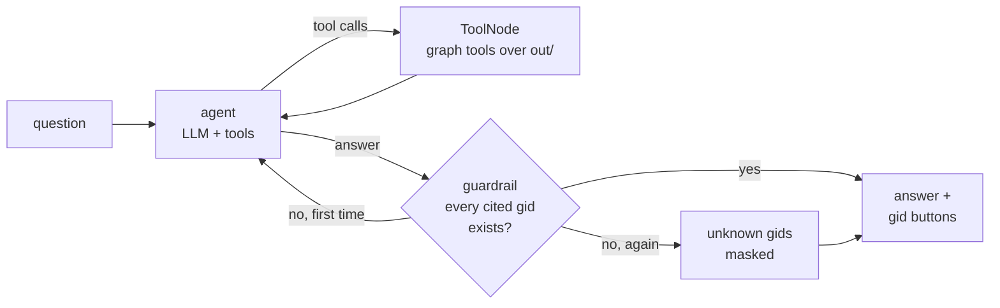

# Assistant

Run the commands below from the project root.

An optional chat tab in the viewer for questions like «кто собирает деньги с этих пятерых: …». It only reads
`out/` through graph tools. It never assigns roles or priorities, and every gid it cites is checked against the graph.

**Enable it:** `cp .env.example .env`, set `OPENAI_API_KEY`, and optionally `OPENAI_MODEL` (default `gpt-4.1-mini`)
and `OPENAI_BASE_URL` for any OpenAI-compatible endpoint. Without a key the tab shows a notice and the rest of the app works.
From the terminal: `python -m agent.graph "<question>"`.

A LangGraph `StateGraph` with at most 8 agent steps. At the last step it has to answer from the tool results it already has.
The prompt allows tool results only, full gids, hypothesis wording, no personal data, and a reply in the question's language.

| Tool | Returns |
|---|---|
| `get_node` | role, evidence, priority and its components, degrees, KZT, seed flow, flags |
| `neighbors` | direct payers / recipients with KZT, top 25 plus totals |
| `paths_between` | directed transfer paths between two gids, up to 4 hops |
| `common_collectors` | who receives from ≥ 2 of a group of gids, with KZT paid straight from the group |
| `top_nodes` | highest priority, optionally by role or without seeds |
| `cluster_summary` | size, seeds, internal KZT, top gids, hypothesis |
| `resilience` | the removal comparison above |
| `tx_timeline` | daily in vs out KZT |

The tools live in `agent/tools.py` over `agent/store.py`, whose pure query functions are also used by the viewer and
tested offline (`tests/test_store.py` and `tests/test_agent.py`, including the guardrail with a scripted model). gids are passed as strings
everywhere, because 18 digits don't survive as JSON floats.

**Guardrail:** after the agent answers, every 15–20 digit number in the answer is looked up. If one isn't a known gid,
the agent is told which ones and rewrites once. If an unknown gid is still there, it is replaced with `[unknown gid]`.

**Eval** (`make eval` → `out/agent_eval.csv`): 10 questions in Russian and English, generated from the graph with a
fixed seed, nothing hand-picked. They cover a group's shared collector, a shared recipient of two clients, payers,
recipients, the biggest recipient, the top 5 and top 3 non-seeds, the middle of a two-hop path, and a cluster's top clients.
The expected gids are computed from the store.

| gid recall | precision | unknown gids | time per question |
|---|---|---|---|
| 1.00 | 0.84 | 0 | ~3 s |

Recall is 10/10. Precision counts cited gids that were neither expected nor in the question, and it is lower only on
the two "shared collector" questions: the agent names the collector paid by all five first, then also lists real partial
collectors paid by 3–4 of them.

**Tracing:** set `LANGFUSE_PUBLIC_KEY`, `LANGFUSE_SECRET_KEY` and `LANGFUSE_BASE_URL` (or `LANGFUSE_HOST`), and each
question becomes a Langfuse trace. The trace shows every graph node, tool call and LLM generation, with tokens and latency.
Without the keys tracing is off and nothing else changes.

