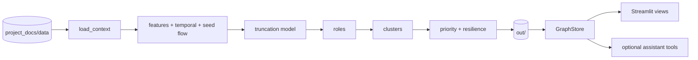

# Architecture and data contract

The application turns the supplied transfer graph into reproducible, explainable
hypotheses. [Methodology](methodology.md) documents rules, findings and limitations;
[assistant reference](assistant.md) documents optional model calls. This document
covers the current code and its boundaries.

## Data flow



`moneygraph/run.py` owns execution order and export. Each step exposes
`compute(ctx) -> pd.DataFrame`, returning exactly one row for every input gid. The
runner validates gids and rejects replacement of existing feature columns before
merging. `Context` carries input tables, the graph, configuration, accumulated
features and model metadata. Required CSV columns stay stable; extra columns may
be appended.

| Order | Module | Responsibility |
|---|---|---|
| Input | `data.py` | Load parquet, validate identifiers and edge/transaction pairs, construct directed graph |
| 1 | `features.py` | Structural and volume metrics, centrality and cycles |
| 2 | `temporal.py` | FIFO pass-through, timing and transaction flags |
| 3 | `taint.py` | Seed-money propagation and seed reachability |
| 4 | `truncation.py` | Infer forwarding probability using inbound-only features |
| 5 | `roles.py` | Ordered role rules, confidence and numeric evidence |
| 6 | `clusters.py` | Community membership and cluster summaries |
| 7 | `priority.py` | Ranking, reasons and removal/resilience comparisons |
| Export | `export.py`, `data_requests.py` | Required tables and requests for missing observations |

All thresholds and weights live in [`config.yaml`](../moneygraph/config.yaml).
The pipeline imports neither Streamlit nor assistant/model libraries. It runs offline.

## Source boundaries

- `moneygraph/paths.py` owns checkout-relative defaults for data, output and configuration.
  Explicit CLI/store paths retain their normal meaning relative to the caller.
- `moneygraph/formatting.py` owns shared display formatting for viewer and fact cards.
  Analytics evidence formatting remains part of its output contract.
- `agent/store.py` provides deterministic, read-only queries over exports and input data.
- `agent/identifiers.py` normalizes client ids and extracts citations without model dependencies.
- `agent/config.py` loads the project environment lazily and supplies optional model settings.
- `agent/cards.py` formats deterministic client facts; prose generation is optional and cached.
- `agent/tools.py` adapts store queries for the assistant. `agent/graph.py` owns its
  tool loop and citation guardrail. `agent/eval.py` owns model-backed evaluation.
- `app/app.py` is the Streamlit entry point. `navigation.py` owns navigation state,
  `resources.py` owns cached resource loading, and `views/` owns screen rendering.
  `charts.py` and `graphview.py` produce charts and graph HTML.

The viewer and assistant never assign roles or priorities. Optional assistant
evaluation and prose caches are separate from pipeline results. The Method view
reads available model, resilience, evaluation and optional benchmark exports;
it does not synthesize missing evidence.

## Feature contract

`out/features.parquet` contains one row per input client (2,248 for the supplied data).

| Columns | Meaning |
|---|---|
| `gid depth is_seed` | Input identity and crawl provenance |
| `in_deg out_deg in_kzt out_kzt in_tx out_tx` | Counterparties, amounts and transfer counts |
| `n_seed_payers pays_seed` | Direct incoming and outgoing seed connections |
| `pagerank hub authority betweenness` | Directed graph centrality |
| `pass_through` | Outflow / inflow, NaN for seeds |
| `fast_pass_share` | Inflow matched to outgoing transfers within the configured window |
| `out_before_in max_same_day_payers active_days` | Temporal profile |
| `seed_flow_in n_seed_sources` | Propagated seed money and distinct reachable seeds |
| `in_cycle cycle_with_seeds` | Cycle membership and participating seed count |
| `p_has_out` | Forwarding probability for depth-4 sinks, NaN elsewhere |
| `flags` | Semicolon-separated temporal/amount signals |
| `role role_detail secondary_roles role_score evidence` | Role hypotheses and support |
| `cluster_id` | Community; zero denotes isolated nodes |
| `priority_score prio_components why` | Normalized priority, JSON contributions and explanation |

Gids remain integers for computation and strings at JSON, model and UI boundaries;
18-digit ids lose precision as floating-point values. In pandas, access the signal
column as `["flags"]`, since `.flags` is also an object attribute.

## Export contract

Required columns are first; additional columns follow:

```text
nodes_roles.csv: gid, role, role_score, cluster_id, priority_score, evidence
clusters.csv:   cluster_id, n_nodes, n_seed, sum_kzt_internal, top_gids, hypothesis
top_nodes.csv:  rank, gid, role, priority_score, why
```

The node table contains every input client; required values are populated. Evidence
contains numbers and is at most 200 characters. Role and priority scores are in
[0, 1]. The top list contains at least 20 clients and is sorted by priority.

Additional pipeline exports are `features.parquet`, `resilience.csv`,
`data_requests.csv` and `truncation_model.json`. The three required CSVs plus
resilience, data requests and the model report are reviewed submission artifacts.
`features.parquet`, evaluation results and prose caches are regenerated locally.

## Verification

Tests exercise synthetic role/query cases, invalid pipeline step contracts, the
full pipeline on supplied data, offline assistant guardrails, optional dependency
isolation and Streamlit navigation. They write generated outputs to temporary
locations. `make check` adds lint and formatting checks to the offline suite.
Compare artifacts before and after analytical refactors using identical random
initialization; the existing HITS eigensolver can introduce tiny floating-point
variation across independent runs.

The provided inputs cannot establish ground-truth roles or client guilt. Seed
inflows are incomplete, depth-4 outgoing transfers were not crawled, and no client
attributes are available. Preserve those qualifications throughout the application.
