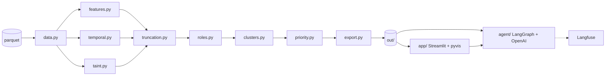

# Design

> Plan written at the start of the hackathon, before any code. Some thresholds and numbers changed during the work
> (e.g. coordinator now needs 2 seeds paid back, transit has a pass-through cap). **The README has the final rules and results.**

Case: «Граф денег» (task in `project_docs/Task_Description.md`, data in `project_docs/data/`).
Question the tool answers for an AML analyst: **which of the 2,248 clients to look at first, and why.**

## What the data tells us

Numbers come from our own EDA; `python -m moneygraph.eda` reproduces them.

| Finding | Consequence |
|---|---|
| Edges found at hop k always start at a depth k-1 node, so the crawl looked at outgoing transfers of every depth 1–3 node | Truncation affects **only the 444 depth-4 nodes**. The 1,091 depth 1–3 nodes with no outgoing transfers are *observed* sinks |
| 35% / 42% / 36% of depth 1 / 2 / 3 nodes send money on | Training signal for inferring what depth-4 nodes do (expect ~160 of 444 to forward) |
| 302 of 671 intermediaries send out *before* they first receive | A plain out/in ratio isn't causal, so use time-aware pass-through |
| max in-degree 24, max out-degree 116; in_deg ≥ 5: 51 nodes; only 3 nodes paid by ≥ 3 seeds | Clear candidates for every role |
| 745 back/lateral edges (125 into seeds); 1,541 cycles of length ≤ 6, incl. 177 two-way pairs | Coordinator and returning-money signals |
| Louvain: 91 communities, 8 with > 1 seed; components 1,877 / 270 / 14 small / 19 isolated seeds | 270-node component = one seed plus two fan-out hubs (116 and 111 recipients), a good demo |
| 429 nodes pass money on within 2 days; 66 cases of ≥ 3 payers to one recipient on the same day | Temporal transit and synchronized fan-in |
| 31% of amounts are multiples of 10k; 42 senders repeat one amount ≥ 5 times; one edge has 67 transfers | Anomaly flags |

## Approach

| Lens | Used for |
|---|---|
| Structural rules | **role**: ordered, documented rules, thresholds in `config.yaml` |
| Seed-money flow | **priority**: where money that left the 81 seeds ends up and converges |
| Self-supervised / statistical | **truncation**: logistic regression predicting "forwards money" for depth-4 nodes; anomaly flags |
| LLM agent | **exploration only**: answers questions via graph tools, cites gids, never assigns roles |

Every value in the output CSVs comes from a rule or an interpretable model whose inputs are printed in the evidence.
The LLM reads the computed tables and never writes them.

## Architecture



```
moneygraph/   config.yaml data.py eda.py features.py temporal.py taint.py
              truncation.py roles.py clusters.py priority.py export.py run.py
app/app.py
agent/        store.py tools.py graph.py cards.py eval.py
tests/
```

Commands: `make run` (= `python -m moneygraph.run --data project_docs/data --out out`), `make app`, `make test`, `make eval`.
The pipeline runs offline in under 60 s and never imports `agent/`.

## Data contract

`out/features.parquet`: one row per gid (2,248 rows).

| Column | Owner | Meaning |
|---|---|---|
| `gid depth is_seed` | B | from nodes.parquet |
| `in_deg out_deg in_kzt out_kzt in_tx out_tx` | A | distinct payers/recipients, KZT, transfer counts within the graph |
| `n_seed_payers pays_seed` | A | # distinct seeds paying the node; # edges from the node into seeds |
| `pagerank hub authority betweenness` | A | directed; pagerank weighted by KZT; HITS; exact betweenness |
| `pass_through` | A | out_kzt / in_kzt, NaN for seeds (their inflow is under-counted) |
| `fast_pass_share` | A | share of inflow matched by outflow within 2 days (FIFO) |
| `out_before_in max_same_day_payers active_days` | A | temporal profile |
| `seed_flow_in n_seed_sources` | A | KZT of seed-originated money reaching the node; # seeds with a directed path to it |
| `in_cycle cycle_with_seeds` | A | on a cycle of length ≤ 4; # distinct seeds on those cycles |
| `p_has_out` | A | truncation model output for depth-4 sinks, NaN otherwise |
| `flags` | A | `;`-separated: `repeat_amount round_amounts near_threshold burst` |
| `role role_detail secondary_roles role_score evidence` | A | see role rules |
| `cluster_id` | B | int; 0 = nodes with no edges |
| `priority_score prio_components why` | B | 0–1; JSON of component contributions; text |

Required CSVs (required columns first, extras after):

```
nodes_roles.csv : gid, role, role_score, cluster_id, priority_score, evidence, [role_detail, secondary_roles, depth, is_seed]
clusters.csv    : cluster_id, n_nodes, n_seed, sum_kzt_internal, top_gids, hypothesis, [dominant_roles, seed_flow_in]
top_nodes.csv   : rank, gid, role, priority_score, why          (30 rows, sorted)
extras          : resilience.csv, data_requests.csv, truncation_model.json, agent_eval.csv
```

## Role rules

Checked in order; the first match wins. Other rules that also match go to `secondary_roles`.
The thresholds are starting values; confirm them against the percentile printout and keep them in `config.yaml` with a one-line reason each.

| # | Role | Rule | Why |
|---|---|---|---|
| 1 | coordinator | (`pays_seed ≥ 1` or `cycle_with_seeds ≥ 2`) and (`n_seed_sources ≥ 2` or betweenness ≥ p98) | money going back into known couriers from a node that sits between several seed flows |
| 2 | distributor | `out_deg ≥ 10` and `out_deg ≥ 3 × max(in_deg, 1)` | fan-out |
| 3 | consolidator | `in_deg ≥ 5` and (`pass_through ≤ 0.5` or `out_deg ≤ in_deg / 3`) | many sources, few exits; distinct payers matter more than KZT |
| 4 | transit | non-seed, in ≥ 1, out ≥ 1, and (`0.8 ≤ pass_through ≤ 1.2` or `fast_pass_share ≥ 0.5`) | passes money on without holding it |
| 5 | terminal | out = 0, in ≥ 1, and (depth ≤ 3 → `terminal_observed`, or depth 4 and `p_has_out < 0.3` → `terminal_inferred`) | at depth ≤ 3 the crawl checked outgoing transfers and found none |
| 6 | peripheral | everything else; `role_detail` ∈ `truncated_unknown`, `truncated_likely_forwarding` (p > 0.6), `no_edges`, `seed_no_outgoing`, `weak_signal` | stays within the dictionary while being honest about gaps |

Seeds never use `in_kzt` or `pass_through`.

**role_score**: for each condition, `m = clip((x - thr) / thr, 0, 1)` (inverse form for ≤), then `0.5 + 0.5 * mean(m)`.
`terminal_observed = 0.9`, `terminal_inferred = 1 - p_has_out`, `peripheral = 1 - max partial match`.

**evidence**: ≤ 200 chars, always with numbers, worded as a hypothesis:
`"19 payers (3 seeds) → 1.82M KZT in; sends on 27%; to 4 recipients; 6 payers same day 14.07"`.

## Truncation model

- Train: non-seed depth 1–3 nodes with in ≥ 1 (~1,700). Label `out_deg > 0`.
- Features (inbound only, so they also exist at depth 4): in_deg, log in_kzt, in_tx, mean/max transfer, round-amount share, active_days, max_same_day_payers, payer out_deg, payer role and pass-through, n_seed_payers. No depth.
- `StandardScaler + LogisticRegression(class_weight="balanced")`, 5-fold stratified CV. AUC and coefficients go to `out/truncation_model.json` and the README.
- Sanity check: mean P on depth 4 ≈ the observed rate at depth 1–3 (0.35–0.42).
- If AUC < 0.6: say so, and mark all depth-4 sinks `truncated_unknown`.
- `data_requests.csv`: likely-forwarding depth-4 gids (request hop 5), seeds without outgoing transfers, seeds needing their incoming transfers, isolated components.

## Seed-money flow

```
s_out[seed] = out_kzt[seed]
6 rounds:
    s_in[v]  = sum_u s_out[u] * w(u,v) / out_kzt[u]    # sparse matrix-vector product
    s_out[v] = min(s_in[v], out_kzt[v])                # non-seeds
seed_flow_in = s_in;  n_seed_sources = # seeds with a directed path (BFS per seed)
```

## Clusters

Louvain on the **undirected** projection (stated in the README), `weight = log1p(sum_kzt)`, `seed=42`.
Nodes with no edges go to `cluster_id = 0`. `top_gids` = top 5 by priority.
Hypothesis templates (first match, with numbers): consolidator + ≥ 2 seeds → collection cell;
distributor → payout network; transit share ≥ 30% → layering chain; terminal share ≥ 60% → end-recipient periphery; else loosely linked group.

## Priority

| Component (percentile-ranked 0–1) | Weight |
|---|---|
| log seed_flow_in | 0.30 |
| role weight × role_score (coord 1.0, cons 0.9, dist 0.8, transit 0.6, terminal 0.5, peri 0.1) | 0.25 |
| n_seed_sources | 0.15 |
| betweenness | 0.15 |
| removal impact (share of downstream seed flow lost if the node is removed; top-100 pre-ranked only) | 0.15 |

Seeds are multiplied by `seed_priority_factor = 0.85` (already known; the case asks us to look above them), then everything is rescaled to 0–1.
`why` = top 2–3 contributions in words with numbers.
`resilience.csv`: remove the top-N (N = 0, 5, 10, 20, 50) by priority vs by degree vs random. Measure the largest component, the number of components, and the share of seed flow reaching depth ≥ 2.

## Assistant

Enabled only when `OPENAI_API_KEY` is set. `OPENAI_MODEL` picks the model; `OPENAI_BASE_URL` allows any OpenAI-compatible endpoint (e.g. NVIDIA build).

- Tools over `agent/store.py` (pure functions, tested without an LLM): `get_node`, `neighbors`, `paths_between`, `common_collectors`, `top_nodes`, `cluster_summary`, `resilience`, `tx_timeline`.
- An explicit LangGraph `StateGraph`: agent → ToolNode loop → guardrail node (every cited gid must exist; otherwise loop back once) → answer. Max 8 steps.
- The prompt requires: tool results only, cite gids, hypothesis wording, no personal data, reply in the question's language.
- Langfuse `CallbackHandler` when `LANGFUSE_*` is set.
- `agent/cards.py`: a deterministic fact card, plus optional LLM prose (cached in `out/cards/`).
- `agent/eval.py`: ~10 questions with answers computed from the graph, scoring gid recall and zero unknown gids; writes `out/agent_eval.csv`.

## Viewer

Streamlit + pyvis. Pages: Overview (KPIs, role counts, clusters, resilience chart) · Network (gid search → ego graph radius 1–2, arrows, width ∝ log KZT, role/cluster colours, seeds outlined, depth-4 dashed; cluster view) · Top list · Node card (evidence, priority breakdown, daily in/out timeline, counterparties, flags, gaps) · Assistant.
Works without an API key. Role colours: coordinator `#9B1C3A`, consolidator `#D0632B`, distributor `#7A4FB0`, transit `#B8921A`, terminal `#2E6E91`, peripheral `#8F9996`.

## Tests

- `test_outputs.py`: 2,248 rows, no nulls in required columns, roles in the dictionary, scores in [0,1], evidence has a digit and ≤ 200 chars, cluster ids consistent, top ≥ 20 and sorted.
- `test_rules.py`: a toy graph per role; depth-4 sink never `terminal_observed`; seed role never uses pass-through.
- `test_no_hardcode.py`: no 18-digit literals in `moneygraph/`.
- `test_runtime.py`: pipeline < 300 s.
- `test_store.py`: agent tools on a toy graph.

## Cut list

If behind at 3:00, cut in this order: agent eval → LLM prose cards → removal-impact component (renormalize weights) → truncation model (fall back to `truncated_unknown`) → the resilience chart.
Never cut: the 3 CSVs, evidence with numbers, the role table in the README, gid search on the map.

## Demo (5 min)

0:00 problem (B) · 0:20 live `make run` (B) · 1:00 overview, clusters, resilience (C) · 1:40 top #1 card, then the 116-recipient distributor (A) ·
2:40 a depth-4 node and `data_requests.csv` (A) · 3:20 assistant "who collects from these five?" plus the Langfuse trace (C) · 4:15 scaling and limitations (B).
